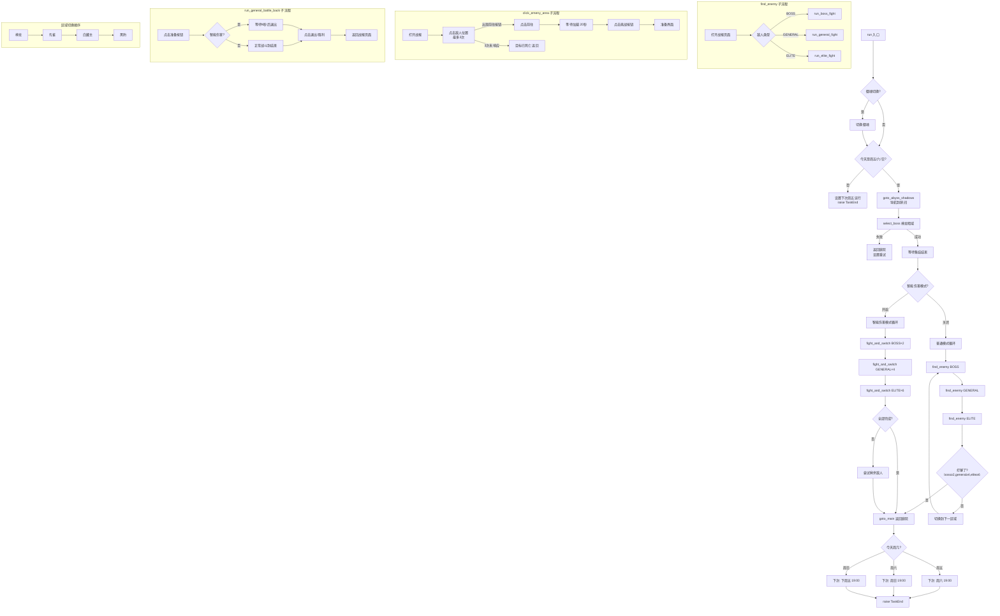

# 狭间暗影（AbyssShadows）任务详解

---

## 1. 文件概述

狭间暗影是阴阳师游戏中的周期性活动任务，仅在**周五、周六、周日**开放。本模块由三个文件组成：

| 文件 | 行数 | 职责 |
|------|------|------|
| `script_task.py` | 569行 | 主任务逻辑：导航、选区、寻敌、战斗、区域切换 |
| `config.py` | 35行 | 配置定义：运行时间、战斗时长、御魂切换 |
| `assets.py` | 105行 | 资源定义：图片模板、点击坐标、滑动方向、OCR列表 |

### 类继承关系

```
ScriptTask
  ├── GeneralBattle      (通用战斗组件)
  ├── GameUi             (游戏页面导航)
  ├── SwitchSoul         (御魂切换)
  └── AbyssShadowsAssets (本任务资源)
```

---

## 2. 配置参数说明

配置定义在 `config.py` 中，使用 Pydantic 模型进行数据校验。

### 2.1 AbyssShadowsTime — 运行时间配置

继承自 `ConfigBase`，用于设置每周各天的自定义运行时间。

| 字段 | 类型 | 默认值 | 说明 |
|------|------|--------|------|
| `custom_run_time_friday` | `Time` | 19:00:00 | 周五运行时间 |
| `custom_run_time_saturday` | `Time` | 19:00:00 | 周六运行时间 |
| `custom_run_time_sunday` | `Time` | 19:00:00 | 周日运行时间 |

### 2.2 AbyssShadowsCombatTime — 智能伤害（战斗计时）

继承自 `BaseModel`，控制战斗中的计时退出策略。

| 字段 | 类型 | 默认值 | 说明 |
|------|------|--------|------|
| `CombatTime_enable` | `bool` | `False` | 是否开启智能伤害模式 |
| `boss_combat_time` | `int` | 60 | 首领战斗持续秒数 |
| `general_combat_time` | `int` | 60 | 副将战斗持续秒数 |
| `elite_combat_time` | `int` | 60 | 精英战斗持续秒数 |

> **智能伤害模式**：开启后，战斗不会打到结束，而是在指定秒数后主动退出。这是一种"打伤害就跑"的策略，用于最大化收益。

### 2.3 AbyssShadows — 主配置

| 字段 | 类型 | 说明 |
|------|------|------|
| `scheduler` | `Scheduler` | 调度器配置 |
| `abyss_shadows_time` | `AbyssShadowsTime` | 运行时间 |
| `abyss_shadows_combat_time` | `AbyssShadowsCombatTime` | 战斗计时 |
| `general_battle_config` | `GeneralBattleConfig` | 通用战斗配置 |
| `switch_soul_config` | `SwitchSoulConfig` | 御魂切换配置 |

---

## 3. 资源定义说明

资源定义在 `assets.py` 中，由 `dev_tools/assets_extract.py` 自动从游戏截图中提取生成。

### 3.1 点击区域（RuleClick）

`RuleClick` 定义了屏幕上的可点击区域，参数含义：
- `roi_front`: 前景区域 `(x, y, width, height)`
- `roi_back`: 背景搜索区域 `(x, y, width, height)`
- `name`: 资源名称

| 资源名 | 说明 |
|--------|------|
| `C_BOSS_CLICK_AREA` | 首领点击区域 |
| `C_GENERAL_1_CLICK_AREA` | 副将1点击区域 |
| `C_GENERAL_2_CLICK_AREA` | 副将2点击区域 |
| `C_ELITE_1_CLICK_AREA` | 精英1点击区域 |
| `C_ELITE_2_CLICK_AREA` | 精英2点击区域 |
| `C_ELITE_3_CLICK_AREA` | 精英3点击区域 |
| `C_CHANGE_ZONE` | 前往阵眼按钮 |
| `C_DRAGON_AREA` / `C_PEACOCK_AREA` / `C_FOX_AREA` / `C_LEOPARD_AREA` | 四大暗域选择区域 |
| `C_ABYSS_DRAGON` / `C_ABYSS_PEACOCK` / `C_ABYSS_FOX` / `C_ABYSS_LEOPARD` | 狭间入口点击区域 |

### 3.2 图片模板（RuleImage）

`RuleImage` 用于屏幕截图的模板匹配识别，参数含义：
- `roi_front`: 模板图像区域
- `roi_back`: 在截图中搜索的范围
- `threshold`: 匹配阈值（0~1），越高越严格
- `method`: 匹配方法（此处均为 `"Template matching"`）
- `file`: 模板图片文件路径

| 资源名 | 说明 |
|--------|------|
| `I_RYOU_SHENSHE` | 阴阳寮→神社入口 |
| `I_RYOU_ABYSS_SHADOWS` | 神社→狭间暗域入口 |
| `I_ABYSS_DRAGON/PEACOCK/FOX/LEOPARD` | 四大暗域入口图片 |
| `I_ABYSS_NAVIGATION` | 战报按钮 |
| `I_ABYSS_MAP` | 战报页面标识 |
| `I_ABYSS_MAP_EXIT` | 战报退出按钮 |
| `I_ABYSS_FIRE` | 挑战按钮 |
| `I_ABYSS_GOTO_ENEMY` | 前往按钮 |
| `I_ENSURE_BUTTON` | 确认按钮（通用弹窗） |
| `I_PEACOCK_AREA` / `I_LEOPARD_AREA` / `I_FOX_AREA` / `I_DRAGON_AREA` | 当前区域标识（顶部标题） |
| `I_CHANGE_AREA` | 更换领域按钮 |
| `I_WAIT_TO_START` | 集结中标识 |
| `I_EQUIPPING` | 准备/装备按钮 |
| `I_IS_ATTACK` | 进攻中标识 |

### 3.3 滑动与列表

| 资源名 | 类型 | 说明 |
|--------|------|------|
| `S_TO_ABBSY_SHADOWS` | `RuleSwipe` | 从当前位置滑动到狭间暗域位置 |
| `L_RYOU_ACTIVITY_LIST` | `RuleList` | 寮活动列表（OCR模式，关键词：道馆、首领、狭间） |

---

## 4. 核心代码逐行解释

### 4.1 辅助类定义

#### 4.1.1 AreaType — 暗域类型（第33~51行）

```python
class AreaType:
    """ 暗域类型 """
    DRAGON = AbyssShadowsAssets.I_ABYSS_DRAGON    # 神龙暗域
    PEACOCK = AbyssShadowsAssets.I_ABYSS_PEACOCK   # 孔雀暗域
    FOX = AbyssShadowsAssets.I_ABYSS_FOX           # 白藏主暗域
    LEOPARD = AbyssShadowsAssets.I_ABYSS_LEOPARD   # 黑豹暗域
```

- 使用类属性映射四种暗域，值为对应的 `RuleImage` 资源对象
- `cached_property name`: 从资源文件路径提取文件名并大写，作为可读名称
- `__str__` / `__repr__`: 打印时显示名称

#### 4.1.2 EmemyType — 敌人类型枚举（第53~58行）

```python
class EmemyType(Enum):
    BOSS = 1       # 首领
    GENERAL = 2    # 副将
    ELITE = 3      # 精英
```

- 使用 `Enum` 定义三种敌人等级
- 用于在 `find_enemy` 中分发战斗逻辑

#### 4.1.3 CilckArea — 点击区域映射（第61~81行）

```python
class CilckArea:
    GENERAL_1 = AbyssShadowsAssets.C_GENERAL_1_CLICK_AREA
    GENERAL_2 = AbyssShadowsAssets.C_GENERAL_2_CLICK_AREA
    ELITE_1 = AbyssShadowsAssets.C_ELITE_1_CLICK_AREA
    ELITE_2 = AbyssShadowsAssets.C_ELITE_2_CLICK_AREA
    ELITE_3 = AbyssShadowsAssets.C_ELITE_3_CLICK_AREA
    BOSS = AbyssShadowsAssets.C_BOSS_CLICK_AREA
```

- 将每种敌人对应的屏幕点击坐标映射为类属性
- 与 `AreaType` 类似，提供 `name` 属性用于日志输出

---

### 4.2 ScriptTask 主类

#### 4.2.1 类定义与类属性（第84~89行）

```python
class ScriptTask(GeneralBattle, GameUi, SwitchSoul, AbyssShadowsAssets):
    boss_fight_count = 0       # 首领战斗次数
    general_fight_count = 0    # 副将战斗次数
    elite_fight_count = 0      # 精英战斗次数
```

- 多继承：继承通用战斗、UI导航、御魂切换、本任务资源
- 三个类属性记录战斗计数，**注意：这是类变量而非实例变量**，多实例共享

#### 4.2.2 run() — 主入口函数（第91~218行）

这是任务的核心入口，执行完整流程：

```python
def run(self):
    cfg: AbyssShadows = self.config.abyss_shadows
```

**阶段1：御魂切换（第98~105行）**

```python
if cfg.switch_soul_config.enable:
    self.ui_get_current_page()
    self.ui_goto(page_shikigami_records)
    self.run_switch_soul(cfg.switch_soul_config.switch_group_team)
if cfg.switch_soul_config.enable_switch_by_name:
    self.ui_get_current_page()
    self.ui_goto(page_shikigami_records)
    self.run_switch_soul_by_name(cfg.switch_soul_config.group_name, cfg.switch_soul_config.team_name)
```

- 两种御魂切换模式：按组号切换 / 按名称切换
- 先导航到式神录页面再执行切换

**阶段2：日期校验（第106~111行）**

```python
today = datetime.now().weekday()
if today not in [4, 5, 6]:  # 4=周五, 5=周六, 6=周日
    logger.info(f"Today is not abyss shadows day, exit")
    self.custom_next_run(task='AbyssShadows', custom_time=cfg.abyss_shadows_time.custom_run_time_friday, time_delta=4-today)
    raise TaskEnd
```

- `weekday()` 返回 0(周一)~6(周日)
- 非开放日则计算距本周五的天数差，设置下次运行时间后抛出 `TaskEnd` 终止

**阶段3：进入狭间暗域（第113~120行）**

```python
self.goto_abyss_shadows()
if not self.select_boss(AreaType.DRAGON):
    logger.warning("Failed to enter abyss shadows")
    self.goto_main()
    self.set_next_run(task='AbyssShadows', finish=False, server=True, success=False)
    raise TaskEnd
```

- 导航到狭间暗域页面
- 默认选择神龙暗域作为第一个区域
- 失败则返回庭院并设置下次重试

**阶段4：等待集结结束（第122~126行）**

```python
self.device.stuck_record_add('BATTLE_STATUS_S')
self.wait_until_disappear(self.I_WAIT_TO_START)
self.device.stuck_record_clear()
```

- 添加卡死检测记录
- 等待"集结中"标识消失（即活动进入可战斗状态）
- 清除卡死检测

**阶段5a：非智能伤害模式（第129~159行）**

```python
if not cfg.abyss_shadows_combat_time.CombatTime_enable:
    while 1:
        find_list = [EmemyType.BOSS, EmemyType.GENERAL, EmemyType.ELITE]
        for enemy_type in find_list:
            if not self.find_enemy(enemy_type):
                break
        # 检查是否打够
        if self.boss_fight_count >= 2 and self.general_fight_count >= 4 and self.elite_fight_count >= 6:
            success = True
            break
        else:
            # 切换区域: 神龙→孔雀→白藏主→黑豹
            ...
```

- 按 BOSS→GENERAL→ELITE 顺序依次寻找并战斗
- 目标：首领2次、副将4次、精英6次
- 打完当前区域后按顺序切换到下一暗域

**阶段5b：智能伤害模式（第162~196行）**

```python
if cfg.abyss_shadows_combat_time.CombatTime_enable:
    while True:
        # 1. 先攻打 BOSS
        if self.boss_fight_count < 2:
            self.boss_fight_count = self.fight_and_switch(EmemyType.BOSS, 2, ...)
        # 2. 攻打 GENERAL
        if self.general_fight_count < 4:
            self.general_fight_count = self.fight_and_switch(EmemyType.GENERAL, 4, ...)
        # 3. 攻打 ELITE
        if self.elite_fight_count < 6:
            self.elite_fight_count = self.fight_and_switch(EmemyType.ELITE, 6, ...)
        # 检查完成状态
        ...
```

- 使用 `fight_and_switch` 方法封装"战斗+切区域"的循环
- 每打完一种敌人就切换区域，直到所有区域遍历完毕

**阶段6：收尾（第198~218行）**

```python
self.goto_main()
if success:
    if today == 4:     # 周五→周六
        self.custom_next_run(..., time_delta=1)
    elif today == 5:   # 周六→周日
        self.custom_next_run(..., time_delta=1)
    elif today == 6:   # 周日→下周五
        self.custom_next_run(..., time_delta=5)
else:
    self.set_next_run(task='AbyssShadows', finish=True, server=True, success=False)
raise TaskEnd
```

- 返回庭院
- 根据当前星期几设置下次运行时间
- 周日完成后跳转到下周五（delta=5天）

---

### 4.3 区域切换相关方法

#### 4.3.1 fight_and_switch() — 攻击并切换区域（第223~242行）

```python
def fight_and_switch(self, enemy_type, required_count, fight_count, next_area_func):
    while fight_count < required_count:
        if not self.find_enemy(enemy_type):
            return fight_count
        else:
            if enemy_type == EmemyType.BOSS:
                fight_count += 1
            elif enemy_type == EmemyType.GENERAL:
                fight_count += 2
            elif enemy_type == EmemyType.ELITE:
                fight_count += 3
        # 战斗完成后切换区域
        current_area = self.check_current_area()
        if fight_count < required_count and current_area != AreaType.LEOPARD:
            next_area_func()
    return fight_count
```

- 循环战斗直到达到目标次数
- 根据敌人类型增加不同计数（BOSS+1, GENERAL+2, ELITE+3）
- 每次战斗后切换到下一区域（除非已到最后的黑豹区域）

#### 4.3.2 switch_area() — 切换到下一区域（第244~257行）

```python
def switch_area(self):
    self.appear_then_click(self.I_ABYSS_MAP_EXIT, interval=1)  # 关闭战报
    current_area = self.check_current_area()
    if current_area == AreaType.DRAGON:
        self.change_area(AreaType.PEACOCK)
    elif current_area == AreaType.PEACOCK:
        self.change_area(AreaType.FOX)
    elif current_area == AreaType.FOX:
        self.change_area(AreaType.LEOPARD)
    else:
        raise StopIteration  # 所有区域完毕
```

- 固定顺序：神龙→孔雀→白藏主→黑豹
- 到达黑豹后抛出 `StopIteration` 退出循环

#### 4.3.3 check_current_area() — 识别当前区域（第261~276行）

```python
def check_current_area(self) -> AreaType:
    while 1:
        self.screenshot()
        if self.appear(self.I_PEACOCK_AREA):
            return AreaType.PEACOCK
        elif self.appear(self.I_DRAGON_AREA):
            return AreaType.DRAGON
        elif self.appear(self.I_FOX_AREA):
            return AreaType.FOX
        elif self.appear(self.I_LEOPARD_AREA):
            return AreaType.LEOPARD
```

- 通过截图+模板匹配识别页面顶部的区域标题
- 无限循环直到识别成功

#### 4.3.4 change_area() — 切换到指定区域（第278~301行）

```python
def change_area(self, area_name: AreaType) -> bool:
    while 1:
        # 确保不在战报页面
        if self.appear_then_click(self.I_ABYSS_MAP_EXIT, interval=1):
            continue
        self.screenshot()
        current_area = self.check_current_area()
        if current_area == area_name:
            break
        # 出现选择界面则点击目标区域
        if self.appear(self.I_ABYSS_DRAGON):
            self.select_boss(area_name)
            continue
        # 点击更换领域按钮打开选择界面
        if self.appear_then_click(self.I_CHANGE_AREA, interval=4):
            continue
    return True
```

- 先关闭可能存在的战报页面
- 检测当前区域是否已是目标，是则退出
- 否则点击"更换领域"按钮打开区域选择界面，再调用 `select_boss` 选择目标

---

### 4.4 导航与选区方法

#### 4.4.1 goto_abyss_shadows() — 进入狭间（第310~332行）

```python
def goto_abyss_shadows(self) -> bool:
    self.ui_get_current_page()
    self.ui_goto(page_guild)       # 导航到阴阳寮页面
    while 1:
        self.screenshot()
        if self.appear_then_click(self.I_RYOU_SHENSHE, interval=1):  # 点击神社
            continue
        if not self.appear(self.I_ABYSS_SHADOWS, threshold=0.8):
            self.swipe(self.S_TO_ABBSY_SHADOWS, interval=3)          # 滑动找到狭间
            continue
        if self.appear_then_click(self.I_ABYSS_SHADOWS):             # 点击狭间
            break
    return True
```

导航路径：`庭院 → 阴阳寮 → 神社 → (滑动) → 狭间暗域`

#### 4.4.2 select_boss() — 选择暗域类型（第334~358行）

```python
def select_boss(self, area_name: AreaType) -> bool:
    click_times = 0
    while 1:
        self.screenshot()
        if self.appear(self.I_ABYSS_DRAGON):  # 在选择界面
            match area_name:
                case AreaType.DRAGON:  is_click = self.click(self.C_ABYSS_DRAGON, interval=2)
                case AreaType.PEACOCK: is_click = self.click(self.C_ABYSS_PEACOCK, interval=2)
                case AreaType.FOX:     is_click = self.click(self.C_ABYSS_FOX, interval=2)
                case AreaType.LEOPARD: is_click = self.click(self.C_ABYSS_LEOPARD, interval=2)
            if is_click:
                click_times += 1
            if click_times >= 3:    # 点击3次仍未进入则判定失败
                return False
            continue
        if self.appear(self.I_ABYSS_NAVIGATION):  # 出现战报按钮说明已进入
            break
    return True
```

- 使用 Python 3.10 的 `match...case` 语法
- 通过点击坐标进入对应暗域，最多尝试3次
- 看到"战报"按钮即确认进入成功

---

### 4.5 战斗相关方法

#### 4.5.1 find_enemy() — 寻找敌人（第360~379行）

```python
def find_enemy(self, enemy_type: EmemyType) -> bool:
    while 1:
        self.screenshot()
        if self.appear(self.I_ABYSS_MAP):    # 确认在战报页面
            break
        if self.appear_then_click(self.I_ABYSS_NAVIGATION, interval=1):  # 点击战报
            continue
    match enemy_type:
        case EmemyType.BOSS:    success = self.run_boss_fight()
        case EmemyType.GENERAL: success = self.run_general_fight()
        case EmemyType.ELITE:   success = self.run_elite_fight()
    return success
```

- 先打开战报页面（显示各敌人位置）
- 根据敌人类型分发到对应的战斗方法

#### 4.5.2 run_boss_fight() — 首领战斗（第381~398行）

```python
def run_boss_fight(self) -> bool:
    if self.boss_fight_count >= 2:
        return True                             # 已打够则跳过
    if self.click_emeny_area(CilckArea.BOSS):   # 点击首领区域
        self.run_general_battle_back(Monster_type="BOSS")  # 执行战斗
        self.boss_fight_count += 1
    else:
        success = False
    return success
```

#### 4.5.3 run_general_fight() — 副将战斗（第400~416行）

```python
def run_general_fight(self) -> bool:
    general_list = [CilckArea.GENERAL_1, CilckArea.GENERAL_2]
    for general in general_list:
        if self.general_fight_count >= 4:
            break
        if self.click_emeny_area(general):
            self.general_fight_count += 1
            self.run_general_battle_back(Monster_type="GENERAL")
    return True
```

- 遍历两个副将位置，达到4次上限则停止

#### 4.5.4 run_elite_fight() — 精英战斗（第419~435行）

```python
def run_elite_fight(self) -> bool:
    elite_list = [CilckArea.ELITE_1, CilckArea.ELITE_2, CilckArea.ELITE_3]
    for elite in elite_list:
        if self.elite_fight_count >= 6:
            break
        if self.click_emeny_area(elite):
            self.elite_fight_count += 1
            self.run_general_battle_back(Monster_type="ELITE")
    return True
```

- 遍历三个精英位置，达到6次上限则停止

#### 4.5.5 click_emeny_area() — 点击敌人区域（第437~502行）

这是最复杂的交互方法，完成"从战报页面到进入战斗"的全流程：

```python
def click_emeny_area(self, click_area: CilckArea) -> bool:
    # 阶段1：打开战报
    while 1:
        self.screenshot()
        if self.appear_then_click(self.I_ABYSS_NAVIGATION, interval=1.5):
            continue
        if self.appear(self.I_ABYSS_MAP):
            break

        # 阶段2：点击敌人位置（最多3次）
        click_times = 0
        while 1:
            if click_times >= 3:
                return                              # 目标已死亡
            if self.appear(self.I_ABYSS_GOTO_ENEMY):
                break                               # 出现"前往"按钮
            if self.click(click_area, interval=1.5):
                click_times += 1
            if self.appear_then_click(self.I_ENSURE_BUTTON, interval=1):
                continue                            # 处理确认弹窗

        # 阶段3：点击前往按钮
        while 1:
            if self.appear_then_click(self.I_ABYSS_GOTO_ENEMY, interval=1):
                if self.appear_then_click(self.I_ENSURE_BUTTON, interval=1):
                    pass                            # 跨区域确认
                sleep(3)                            # 等待跑图动画
                continue
            else:
                break

        # 阶段4：等待战斗按钮出现（超时20秒）
        if self.wait_until_appear(self.I_ABYSS_FIRE, wait_time=20):
            break

    # 阶段5：点击挑战按钮
    while 1:
        if self.appear_then_click(self.I_ABYSS_FIRE, interval=1):
            if self.appear_then_click(self.I_ENSURE_BUTTON, interval=1):
                pass                                # 奖励次数上限确认
            continue
        if self.appear(self.I_PREPARE_HIGHLIGHT):
            break                                   # 出现准备高亮，进入成功
    return True
```

执行流程：`打开战报 → 点击敌人 → 前往 → 等待加载 → 挑战 → 确认进入准备界面`

#### 4.5.6 run_general_battle_back() — 战斗执行（第504~558行）

这是重写父类的方法，实现狭间暗域特有的战斗流程：

```python
def run_general_battle_back(self, Monster_type: str) -> bool:
    cfg: AbyssShadows = self.config.abyss_shadows

    # 阶段1：点击准备按钮
    while 1:
        if self.wait_until_appear(self.I_EQUIPPING, wait_time=4):
            self.click(self.I_EQUIPPING, interval=1.5)
        if not self.appear(self.I_EQUIPPING):
            break

    # 阶段2：智能伤害计时
    start_time = time.time()
    if cfg.abyss_shadows_combat_time.CombatTime_enable:
        self.device.stuck_record_add('BATTLE_STATUS_S')
        # 根据敌人类型选择计时时长
        if Monster_type == "BOSS":
            combat_time = cfg.abyss_shadows_combat_time.boss_combat_time
        elif Monster_type == "GENERAL":
            combat_time = cfg.abyss_shadows_combat_time.general_combat_time
        elif Monster_type == "ELITE":
            combat_time = cfg.abyss_shadows_combat_time.elite_combat_time
        else:
            combat_time = 60

        # 等待战斗时间结束或提前胜利
        while time.time() - start_time < combat_time:
            self.screenshot()
            if self.appear_then_click(self.I_WIN, interval=1.5):
                break
        self.device.stuck_record_clear()

    # 阶段3：处理战斗结束
    if self.appear_then_click(self.I_WIN, interval=1.5):
        return True

    # 阶段4：手动退出战斗
    while 1:
        if self.appear_then_click(self.I_EXIT, interval=2):
            continue
        if self.appear_then_click(self.I_EXIT_ENSURE, interval=2):
            continue
        if self.appear_then_click(self.I_WIN, interval=2):
            continue
        if self.appear(self.I_ABYSS_NAVIGATION):
            break
    return True
```

**关键逻辑**：
- 非智能伤害模式：正常战斗到结束
- 智能伤害模式：计时到后点击退出按钮（`I_EXIT` → `I_EXIT_ENSURE`）
- 如果计时期间已经胜利（`I_WIN` 出现），则直接返回

---

### 4.6 辅助方法

#### goto_main() — 返回庭院（第303~308行）

```python
def goto_main(self):
    self.ui_get_current_page()
    self.ui_goto(page_main)
```

#### 入口脚本（第562~569行）

```python
if __name__ == "__main__":
    config = Config('zhu')
    device = Device(config)
    t = ScriptTask(config, device)
    t.run()
```

- 独立运行时使用 `'zhu'` 配置文件初始化

---

## 5. 任务执行流程图



---

## 6. 设计模式总结

### 6.1 模板方法模式（Template Method）

`ScriptTask` 继承 `GeneralBattle` 并重写 `run_general_battle_back()` 方法，定制了狭间暗域特有的战斗流程（准备→计时→退出），而非使用父类的默认"战斗到结束"流程。

### 6.2 策略模式（Strategy）

通过 `CombatTime_enable` 配置开关，在运行时选择两种战斗策略：
- **普通策略**：打到战斗自然结束
- **智能伤害策略**：计时后主动退出，最大化伤害效率

### 6.3 状态机模式（State Machine）

区域切换隐含了一个线性状态机：

```
神龙 → 孔雀 → 白藏主 → 黑豹 → 结束
```

`check_current_area()` 作为状态检测器，`change_area()` 作为状态转换器。

### 6.4 资源分离模式

所有屏幕识别资源（图片模板、点击坐标、滑动方向）集中在 `assets.py` 中管理，与业务逻辑完全解耦。资源由工具自动生成，便于游戏界面更新后重新提取。

### 6.5 防御性编程

- **卡死检测**：`device.stuck_record_add/clear` 防止脚本在等待中卡死
- **重试上限**：点击敌人最多3次、选择暗域最多3次，避免无限循环
- **多层确认弹窗处理**：`I_ENSURE_BUTTON` 在多个位置被处理，应对游戏中的各种确认对话框

### 6.6 潜在问题

| 问题 | 位置 | 说明 |
|------|------|------|
| 类变量共享 | 第87~89行 | `boss_fight_count` 等是类变量，多实例会共享状态 |
| 变量名拼写 | `EmemyType` / `CilckArea` | 应为 `EnemyType` / `ClickArea` |
| 魂切换重复导航 | 第99~105行 | 两种御魂切换模式各自调用 `ui_goto`，可能重复导航 |
| print 未替换 | 第180行、第203行 | 应统一使用 `logger` |
| return 无值 | 第460行 | `click_emeny_area` 中 `return` 未返回 `False`，实际返回 `None` |
