# CollectiveMissions（集体任务）代码详解

## 1. 文件概述

本模块负责阴阳师游戏中「集体任务」的自动化执行，包含三个核心文件：

| 文件 | 行数 | 职责 |
|------|------|------|
| `script_task.py` | 393 | 主任务逻辑：导航、识别、执行、退出 |
| `config.py` | 37 | 配置模型：优先级规则、任务选择、调度器 |
| `assets.py` | 117 | UI 资源定义：图片模板、点击坐标、OCR 区域、滑动参数 |

任务支持以下集体任务类型：
- **契灵探查**（BL）— 特殊处理：检查完成状态，未完成则调度契灵之境任务
- **觉醒一/二/三**（AW1/AW2/AW3）— 捐赠觉醒材料
- **御灵一/二/三**（GR1/GR2/GR3）— 捐赠御灵材料
- **御魂一/二**（SO1/SO2）— 提交御魂
- **结伴同行**（FRIEND）— 识别但不处理
- **远远不够**（FEED）— 喂 N 卡

---

## 2. 配置参数说明

> 源文件：`config.py`

### 2.1 `MissionsConfig`（任务配置）

```python
class MissionsConfig(BaseModel):
    missions_rule: MultiLine = Field(default='契灵 > 觉醒三 > 觉醒二 > ...', description='missions_rule_help')
    setup_when_bondling: bool = Field(default=True, description='setup_when_bondling_help')
    missions_select: str = Field(default='觉醒三', description='指定的任务')
```

| 字段 | 类型 | 默认值 | 说明 |
|------|------|--------|------|
| `missions_rule` | `MultiLine`（多行字符串） | `'契灵 > 觉醒三 > 觉醒二 > 觉醒一 > 御灵三 > 御灵二 > 御灵一 > 御魂二 > 御魂一 > 远远不够'` | 任务优先级规则，用 `>` 分隔，越靠左优先级越高 |
| `setup_when_bondling` | `bool` | `True` | 当检测到契灵任务时是否自动设置契灵之境调度 |
| `missions_select` | `str` | `'觉醒三'` | 指定要切换到的任务类型 |

### 2.2 `MissionsConfig.mr_validator`（验证器）

```python
@validator('missions_rule', pre=True, always=True)
def mr_validator(cls, v):
    if isinstance(v, str):
        return v.replace('御魂五', '御魂二').replace('御魂四', '御魂一')
    return v
```

- **作用**：兼容旧版配置。游戏更新后御魂任务从"御魂四/五"改为"御魂一/二"，验证器自动做文本替换，避免用户手动修改配置。

### 2.3 `CollectiveMissions`（顶层配置）

```python
class CollectiveMissions(ConfigBase):
    scheduler: Scheduler = Field(default_factory=Scheduler)
    missions_config: MissionsConfig = Field(default_factory=MissionsConfig)
```

- `scheduler`：继承自 `ConfigBase` 的调度器，控制任务的下次运行时间、是否启用等。
- `missions_config`：嵌套的任务配置。

---

## 3. 资源定义说明

> 源文件：`assets.py`

所有资源由 `dev_tools/assets_extract.py` 自动从游戏截图中提取生成，`CollectiveMissionsAssets` 类作为 mixin 被 `ScriptTask` 继承。

### 3.1 点击资源（RuleClick）

| 变量名 | ROI | 说明 |
|--------|-----|------|
| `C_CM_1` | `(231, 468, 141, 55)` | 第一个集体任务的点击区域 |
| `C_CM_2` | `(567, 468, 143, 55)` | 第二个集体任务的点击区域 |
| `C_CM_3` | `(903, 470, 136, 58)` | 第三个集体任务的点击区域 |

### 3.2 图片模板资源（RuleImage）

| 变量名 | 用途 | 阈值 | 模板路径 |
|--------|------|------|----------|
| `I_CM_SHRINE` | 神社入口图标 | 0.8 | `cm/cm_cm_shrine.png` |
| `I_CM_CM` | 集体任务入口 | 0.8 | `cm/cm_cm_cm.png` |
| `I_CM_PRESENT` | 提交按钮 | 0.8 | `cm/cm_cm_present.png` |
| `I_CM_RECORDS` | 到达判断（记录图标） | 0.8 | `cm/cm_cm_records.png` |
| `I_CM_MATTER` | 材料拉满按钮 | 0.8 | `cm/cm_cm_matter.png` |
| `I_CM_ADD_1~4` | 四种材料的添加按钮 | 0.8 | `cm/cm_cm_add_1~4.png` |
| `I_CM_REWARDS` | 领取奖励按钮 | 0.8 | `cm/cm_cm_rewards.png` |
| `I_CM_SWITCH` | 切换任务按钮 | 0.8 | `cm/cm_cm_switch.png` |
| `I_FEED_HEAP` | 喂卡堆叠入口 | 0.8 | `feed/feed_feed_heap.png` |
| `I_FEED_SUBMIT` | 喂卡提交按钮 | 0.8 | `feed/feed_feed_submit.png` |
| `I_SL_SUBMIT` | 御魂提交按钮 | 0.8 | `soul/soul_sl_submit.png` |

### 3.3 OCR 资源（RuleOcr）

| 变量名 | ROI | 模式 | 用途 |
|--------|-----|------|------|
| `O_CM_1` ~ `O_CM_6` | 6个任务名区域 | `Single` | 识别三个任务的名称（每个任务占两个 OCR 区域） |
| `O_CM_NUMBER` | `(1105, 564, 60, 28)` | `DigitCounter` | 识别已完成次数（如 `20/30`） |
| `O_CM_1_MATTER` ~ `O_CM_4_MATTER` | 4个材料数量区域 | `DigitCounter` | 识别捐赠材料的数量 |
| `O_SL_LEVEL` | `(174, 139, 30, 24)` | `Single` | 御魂等级识别（关键字 `古`） |
| `O_SL_NUMBER` | `(813, 94, 187, 39)` | `Single` | 御魂提交次数 |

**OCR 模式说明**：
- `Single`：返回单行文本字符串
- `DigitCounter`：返回三元组 `(current, remain, total)`，用于 `x/y` 格式的数字识别

### 3.4 滑动资源（RuleSwipe）

| 变量名 | 起点 ROI → 终点 ROI | 用途 |
|--------|---------------------|------|
| `S_CM_MATTER_1` | `(684,147) → (1060,142)` | 滑动到第一种材料 |
| `S_CM_MATTER_2` | `(684,271) → (1066,261)` | 滑动到第二种材料 |
| `S_CM_MATTER_3` | `(688,392) → (1117,388)` | 滑动到第三种材料 |
| `S_CM_MATTER_4` | `(689,524) → (903,518)` | 滑动到第四种材料 |

### 3.5 长按资源（RuleLongClick）

| 变量名 | ROI | 持续时间 | 用途 |
|--------|-----|----------|------|
| `L_FEED_CLICK_1~4` | 4个卡牌位置 | 1500ms | 长按选择 N 卡进行喂养 |
| `L_SL_LONG` | `(178, 194, 58, 49)` | 1500ms | 长按选择御魂进行提交 |

---

## 4. 核心代码逐行解释

### 4.1 头部导入（第1-18行）

```python
import time          # 用于 time.sleep() 等待
import random        # 用于随机选择点击目标（window_message 模式下的降级策略）
import re            # 用于正则分割优先级规则、提取数字
from cached_property import cached_property  # 缓存属性装饰器，避免重复解析规则
from enum import Enum                        # 枚举基类
from datetime import timedelta               # 时间差计算（契灵任务的2小时延迟）

from module.exception import TaskEnd, RequestHumanTakeover  # 任务结束/人工接管异常
from module.logger import logger             # 日志模块
from module.base.timer import Timer          # 计时器（用于超时退出循环）
from module.atom.ocr import RuleOcr          # OCR 规则类型提示

from tasks.GameUi.game_ui import GameUi      # 游戏 UI 操作基类（截图、点击、滑动等）
from tasks.GameUi.page import page_main, page_guild  # 页面定义（主页、阴阳寮）
from tasks.CollectiveMissions.assets import CollectiveMissionsAssets  # 资源 mixin
```

### 4.2 MC 枚举类（第21-33行）

```python
class MC(str, Enum):
    BL = '契灵'          # 契灵探查 — 特殊处理路径
    AW1 = '觉醒一'       # 觉醒副本一
    AW2 = '觉醒二'       # 觉醒副本二
    AW3 = '觉醒三'       # 觉醒副本三
    GR1 = '御灵一'       # 御灵副本一
    GR2 = '御灵二'       # 御灵副本二
    GR3 = '御灵三'       # 御灵副本三
    SO1 = '御魂一'       # 御魂副本一
    SO2 = '御魂二'       # 御魂副本二
    FRIEND = '结伴同行'   # 结伴同行（仅识别，不执行）
    UNKNOWN = '未知'      # 无法识别的任务
    FEED = '远远不够'     # 喂 N 卡任务
```

- 继承 `str` 和 `Enum`，使枚举值可以直接与字符串比较（如 `mission == '觉醒三'`）。
- 每个枚举的 `.value` 是游戏中显示的中文任务名。

### 4.3 ScriptTask 类定义与 rule 属性（第35-46行）

```python
class ScriptTask(GameUi, CollectiveMissionsAssets):
    missions: list = []  # 类变量，用于记录三个任务的种类（实际未在代码中使用）

    @cached_property
    def rule(self) -> list:
        rule = self.config.collective_missions.missions_config.missions_rule  # 从配置读取优先级字符串
        rule = rule.replace(' ', '').replace('\n', '')  # 去除空格和换行
        rule = re.split(r'>', rule)                      # 按 '>' 分割为列表
        mc_values_list = [member.value for member in MC] # 获取所有枚举值
        rule = [item for item in rule if item in mc_values_list]  # 过滤掉无效项
        return rule  # 例如 ['契灵', '觉醒三', '觉醒二', ...]
```

- **`cached_property`**：只在首次访问时解析，后续直接返回缓存结果。
- **过滤逻辑**：确保优先级列表中只包含 `MC` 枚举定义的有效任务名，忽略拼写错误或无效条目。

### 4.4 `run()` 主入口方法（第48-95行）

```python
def run(self):
    # ===== 第一阶段：导航到集体任务界面 =====
    self.ui_get_current_page()           # 检测当前所在页面
    self.ui_goto(page_guild)             # 导航到阴阳寮页面
    rule = self.config.collective_missions.missions_config.missions_rule  # 读取规则（未使用）
    self.ui_click(self.I_CM_SHRINE, self.I_CM_CM)   # 点击神社 → 等待集体任务入口出现
    self.ui_click(self.I_CM_CM, self.I_CM_RECORDS)   # 点击集体任务 → 等待记录页面出现
```

```python
    # ===== 第二阶段：检测今日完成情况 =====
    logger.info('Start to detect missions')
    self.screenshot()
    current, remain, total = self.O_CM_NUMBER.ocr(self.device.image)  # OCR 识别 "20/30"
    if current == total == 30:  # 已完成 30/30
        logger.warning('Today\'s missions have been completed')
        self.set_next_run(task='CollectiveMissions', success=False, finish=True)
        raise TaskEnd('CollectiveMissions')  # 抛出异常结束任务
```

```python
    # ===== 第三阶段：切换到目标任务 =====
    mission_name = self.config.collective_missions.missions_config.missions_select
    self.select_mission(mission_name)  # 循环点击切换按钮直到识别到目标任务
```

```python
    # ===== 第四阶段：识别最优任务并执行 =====
    mission, index = self.detect_best()  # OCR 识别三个任务，按优先级选最优
    logger.info(f'Best mission is {mission}')
    logger.info(f'Best mission index is {index}')

    if mission == MC.BL:           # 契灵 → 特殊处理
        self._bondling_fairyland(index)
    elif mission == MC.FEED:       # 喂 N 卡
        self._feed(index)
    elif mission in (MC.AW1, MC.AW2, MC.AW3, MC.GR1, MC.GR2, MC.GR3):  # 觉醒/御灵 → 捐材料
        self._donate(index)
    elif mission in (MC.SO1, MC.SO2):  # 御魂 → 提交御魂
        self._soul(index)
```

```python
    # ===== 第五阶段：退出回到神社页面 =====
    while 1:
        self.screenshot()
        if self.appear(self.I_CM_SHRINE) or self.appear(self.I_CHECK_MAIN):
            break  # 已回到神社或主页面
        if self.appear_then_click(self.I_UI_BACK_RED, interval=1):   # 点击红色返回
            continue
        if self.appear_then_click(self.I_UI_BACK_YELLOW, interval=1): # 点击黄色返回
            continue

    self.set_next_run(task='CollectiveMissions', success=True, finish=True)
    raise TaskEnd('CollectiveMissions')
```

### 4.5 `detect_one()` 单任务识别（第98-132行）

```python
def detect_one(self, ocr_1: RuleOcr, ocr_2: RuleOcr) -> MC:
    """
    检测某一个位置是什么任务
    ocr_1: 任务名称的第一个 OCR 区域（如 "契灵探查"、"结伴同行"）
    ocr_2: 任务名称的第二个 OCR 区域（如 "觉醒一"、"御魂二"）
    """
    self.screenshot()
    result_1 = ocr_1.ocr(self.device.image)  # 第一次 OCR
    result_2 = ocr_2.ocr(self.device.image)  # 第二次 OCR
    result_1 = result_1.replace('·', '')      # 去除 OCR 可能误识别的中间点

    if result_1 == '结伴同行':     return MC.FRIEND
    elif result_1 == '契灵探查':   return MC.BL
    # 如果不是上述特殊任务，则根据第二个 OCR 结果判断
    if result_2 == '觉醒一':       return MC.AW1
    elif result_2 == '觉醒二':     return MC.AW2
    elif result_2 == '觉醒三':     return MC.AW3
    elif result_2 == '御灵一':     return MC.GR1
    elif result_2 == '御灵二':     return MC.GR2
    elif result_2 == '御灵三':     return MC.GR3
    elif result_2 == '御魂一':     return MC.SO1
    elif result_2 == '御魂二':     return MC.SO2
    if result_1 == '远远不够':     return MC.FEED
    return MC.UNKNOWN  # 无法识别
```

**识别逻辑**：
1. 游戏中每个集体任务的名称由两部分组成（如 "契灵" + "探查"，"觉醒" + "三"）
2. 先检查第一个 OCR 区域是否为特殊任务名（结伴同行、契灵探查、远远不够）
3. 否则根据第二个 OCR 区域匹配具体副本次数

### 4.6 `detect_best()` 最优任务选择（第134-153行）

```python
def detect_best(self) -> tuple:
    """自动寻找最好的任务并返回，期间记录三个任务的类型"""
    # 对三个任务分别进行 OCR 识别
    first_class = self.detect_one(self.O_CM_1, self.O_CM_2)   # 任务 0
    second_class = self.detect_one(self.O_CM_3, self.O_CM_4)  # 任务 1
    third_class = self.detect_one(self.O_CM_5, self.O_CM_6)   # 任务 2

    # 将识别结果映射为优先级序号（在 rule 列表中的索引）
    # 如果不在 rule 中，设为 100/101/102（低优先级）
    first_order = self.rule.index(first_class) if first_class in self.rule else 100
    second_order = self.rule.index(second_class) if second_class in self.rule else 101
    third_order = self.rule.index(third_class) if third_class in self.rule else 102

    # 选择序号最小的（优先级最高的）
    if first_order < second_order and first_order < third_order:
        best_index, best_class = 0, first_class
    elif second_order < first_order and second_order < third_order:
        best_index, best_class = 1, second_class
    elif third_order < first_order and third_order < second_order:
        best_index, best_class = 2, third_class
    return best_class, best_index
```

**优先级机制**：
- `self.rule` 是一个有序列表，如 `['契灵', '觉醒三', '觉醒二', ...]`
- 索引越小优先级越高
- 不在列表中的任务获得高索引值（100+），基本不会被选中

### 4.7 `_bondling_fairyland()` 契灵处理（第156-189行）

```python
def _bondling_fairyland(self, index: int):
    """契灵探查的特殊处理"""

    def bondling_finish():
        self.screenshot()
        if self.appear(self.I_CM_REWARDS):  # 检查是否有奖励按钮（说明已完成）
            return True
        return False

    if not bondling_finish():
        # 未完成 → 设置契灵之境任务的调度
        self.config.bondling_fairyland.scheduler.next_run = self.start_time
        if not self.config.bondling_fairyland.scheduler.enable:
            logger.error('The scheduler of bondling_fairyland is not enable')
            raise RequestHumanTakeover  # 契灵之境未启用，需要人工处理
        # 将当前任务推迟 2 小时后再执行（等契灵之境完成后回来领奖）
        self.set_next_run(task='CollectiveMissions', success=True, finish=True,
                         target=self.start_time + timedelta(hours=2))
        return True

    # 已完成 → 领取奖励
    logger.info('Start to collect bondling rewards')
    check_timer = Timer(3)  # 3秒无操作则退出
    check_timer.start()
    while 1:
        self.screenshot()
        if self.ui_reward_appear_click(True):    # 点击奖励弹窗
            check_timer.reset()
            continue
        if self.appear_then_click(self.I_CM_REWARDS, interval=1):  # 点击领取按钮
            check_timer.reset()
            continue
        if check_timer.reached():  # 3秒无新弹窗，认为领完了
            break
```

**流程**：契灵任务需要先完成契灵之境副本。如果未完成，脚本会自动设置契灵之境任务的调度，并将集体任务推迟 2 小时。

### 4.8 `_donate()` 捐赠材料（第191-281行）

```python
def _donate(self, index: int):
    """捐赠觉醒/御灵材料"""
    # 点击对应任务位置
    match_click = {0: self.C_CM_1, 1: self.C_CM_2, 2: self.C_CM_3}
    while 1:
        self.screenshot()
        if self.appear(self.I_CM_PRESENT):  # 等待提交界面出现
            break
        if self.click(match_click[index], interval=1.5):
            continue
```

```python
    # 识别四种材料的数量，选择数量最多的
    self.screenshot()
    max_index, max_number = 0, 0
    for i, ocr in enumerate([self.O_CM_1_MATTER, self.O_CM_2_MATTER,
                             self.O_CM_3_MATTER, self.O_CM_4_MATTER]):
        curr, remain, total = ocr.ocr(self.device.image)
        if total > max_number:
            max_number = total
            max_index = i

    if max_number <= 30:  # 所有材料都不足 30，可能是分辨率问题
        raise RequestHumanTakeover
```

```python
    # 滑动到数量最多的材料
    window_control = self.config.script.device.control_method == 'window_message'
    swipe_count, click_count = 0, 0
    while 1:
        self.screenshot()
        if self.appear(self.I_CM_MATTER):  # 拉满按钮出现，说明已滑动到位
            break
        # 普通模式：使用滑动操作
        if not window_control and self.swipe(match_swipe[max_index], interval=2.5):
            swipe_count += 1
            time.sleep(1.5)
            continue
        # window_message 模式：滑动不可用，改用随机点击（降级策略）
        if window_control and click_count > 30:
            break  # 超过 30 次仍失败，放弃
        if window_control and self.click(random.choice(random_click), interval=0.7):
            click_count += 1
            continue
        # 普通模式滑动超过 5 次仍失败
        if not window_control and swipe_count >= 5:
            raise RequestHumanTakeover
```

```python
    # 领取奖励（可能有双倍奖励，需要领取两次）
    reward_number = 0
    while 1:
        self.screenshot()
        if reward_number >= 2:
            break
        if self.ui_reward_appear_click(False):  # 不关闭最后一个弹窗
            reward_number += 1
            continue
        if self.appear_then_click(self.I_CM_PRESENT, interval=1):  # 点击提交
            continue
    self.ui_reward_appear_click(True)  # 关闭最后一个弹窗
```

### 4.9 `select_mission()` 切换任务（第283-301行）

```python
def select_mission(self, missions_select: str) -> bool:
    """循环点击切换按钮，直到当前第一个任务为目标任务"""
    while 1:
        self.screenshot()
        missions = self.detect_one(self.O_CM_1, self.O_CM_2)  # 识别当前第一个任务
        if missions == missions_select:
            return True  # 已切换到目标任务
        else:
            self.appear_then_click(self.I_CM_SWITCH, interval=1)  # 点击切换按钮
```

### 4.10 `_soul()` 御魂提交（第303-346行）

```python
def _soul(self, index: int):
    """提交御魂"""
    match_click = {0: self.C_CM_1, 1: self.C_CM_2, 2: self.C_CM_3}
    self.ui_click(match_click[index], self.I_SL_SUBMIT)  # 点击任务 → 等待提交界面

    while 1:
        self.screenshot()
        number_text = self.O_SL_NUMBER.ocr(self.device.image)
        submit_number = int(re.findall(r'\d+', number_text)[-1])  # 提取可提交次数
        if submit_number > 0:
            break  # 有可提交的御魂

        # 检查是否还有御魂可提交
        if self.ocr_appear(self.O_SL_LEVEL):  # 识别到等级文字，说明没有御魂了
            self.ui_click(self.I_UI_BACK_RED, self.I_CM_RECORDS)
            return False  # 退出

        if self.click(self.L_SL_LONG, interval=2.5):  # 长按选择御魂
            time.sleep(1)
            continue

    # 领取奖励
    check_timer = Timer(3)
    check_timer.start()
    while 1:
        self.screenshot()
        if self.ui_reward_appear_click(True):
            check_timer.reset()
            continue
        if self.appear_then_click(self.I_SL_SUBMIT, interval=1):
            check_timer.reset()
            continue
        if check_timer.reached():
            break
    self.wait_until_appear(self.I_CM_RECORDS)  # 等待返回记录页面
```

### 4.11 `_feed()` 喂 N 卡（第348-379行）

```python
def _feed(self, index: int):
    """喂养 N 卡完成'远远不够'任务"""
    match_click = {0: self.C_CM_1, 1: self.C_CM_2, 2: self.C_CM_3}
    self.ui_click(match_click[index], self.I_FEED_HEAP)  # 点击任务 → 等待堆叠界面

    # 随机选择 2 个卡牌位置进行长按喂养
    click_list = random.sample(
        [self.L_FEED_CLICK_1, self.L_FEED_CLICK_2, self.L_FEED_CLICK_3, self.L_FEED_CLICK_4], 2
    )
    while 1:
        self.screenshot()
        if self.appear(self.I_FEED_SUBMIT):  # 提交按钮出现
            break
        for click in click_list:
            self.click(click)  # 点击选中的卡牌

    # 领取奖励（双倍机制同 _donate）
    reward_number = 0
    while 1:
        self.screenshot()
        if reward_number >= 2:
            break
        if self.ui_reward_appear_click(False):
            reward_number += 1
            continue
        if self.appear_then_click(self.I_FEED_SUBMIT, interval=1):
            continue
    self.ui_reward_appear_click(True)
```

### 4.12 测试入口（第384-393行）

```python
if __name__ == '__main__':
    from module.config.config import Config
    from module.device.device import Device
    c = Config('oas1')         # 加载配置（配置名为 'oas1'）
    d = Device(c)              # 初始化设备连接
    t = ScriptTask(c, d)       # 创建任务实例
    t.screenshot()             # 截取当前屏幕
    t.run()                    # 执行任务
```

---

## 5. 任务执行流程图

```mermaid
flowchart TD
    A[开始 run] --> B[导航到阴阳寮页面]
    B --> C[点击神社 → 集体任务]
    C --> D[OCR 检测今日完成数]
    D -->|30/30 已完成| E[设置下次运行 → TaskEnd]
    D -->|未完成| F[切换到目标任务 select_mission]
    F --> G[OCR 识别三个任务 detect_best]
    G --> H{最优任务类型?}

    H -->|契灵 BL| I{契灵之境已完成?}
    I -->|是| J[领取奖励]
    I -->|否| K[设置契灵之境调度<br/>推迟2小时后重试]

    H -->|远远不够 FEED| L[进入喂卡界面]
    L --> M[随机选择2个卡牌长按]
    M --> N[领取奖励]

    H -->|觉醒/御灵| O[点击对应任务]
    O --> P[OCR 识别四种材料数量]
    P --> Q[滑动到数量最多的材料]
    Q --> R[点击提交领取奖励]

    H -->|御魂 SO1/SO2| S[点击对应任务]
    S --> T[长按选择御魂]
    T --> U{有可提交御魂?}
    U -->|是| V[提交领取奖励]
    U -->|否| W[退出御魂界面]

    J --> X[退出循环返回神社]
    K --> E
    N --> X
    R --> X
    V --> X
    W --> X
    X --> Y[set_next_run → TaskEnd]
```



---

## 6. 设计模式总结

### 6.1 模板方法模式（Template Method）
- `ScriptTask` 继承 `GameUi`，复用 `ui_goto`、`ui_click`、`ui_reward_appear_click` 等通用 UI 操作方法。
- `run()` 定义了固定的任务骨架：导航 → 检测 → 选择 → 执行 → 退出。

### 6.2 策略模式（Strategy）
- 任务执行通过 `if/elif` 分支选择不同的处理策略：`_bondling_fairyland`、`_donate`、`_soul`、`_feed`。
- 每种策略封装了独立的 UI 交互逻辑。

### 6.3 Mixin 模式（Mixin Inheritance）
- `CollectiveMissionsAssets` 作为 mixin 类，提供所有 UI 资源定义。
- 资源由工具自动生成，与业务逻辑解耦。

### 6.4 声明式配置（Declarative Config）
- 使用 Pydantic `BaseModel` 定义配置结构，支持类型验证、默认值、自定义验证器。
- 优先级规则以人类可读的字符串形式配置（如 `'契灵 > 觉醒三 > ...'`）。

### 6.5 轮询等待模式（Polling Loop）
- 所有 UI 交互均采用 `while 1` + `screenshot()` + `appear/click` 的轮询模式。
- 使用 `Timer` 对象实现超时退出，避免死循环。
- `interval` 参数控制点击频率，防止操作过快。

### 6.6 异常驱动的流程控制
- `TaskEnd` 异常用于正常结束任务（非错误），触发调度器设置下次运行时间。
- `RequestHumanTakeover` 异常用于遇到无法自动处理的情况（如分辨率问题、功能未启用）。
