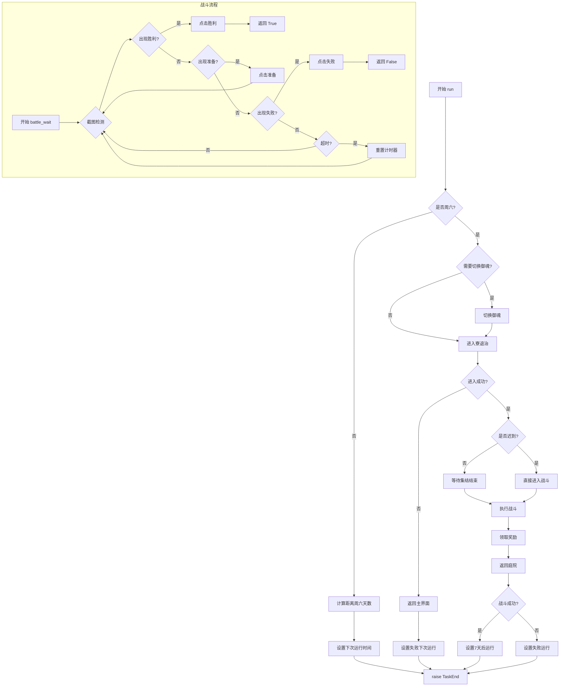

# 寮退治 (DemonRetreat) 任务详解

## 1. 文件概述

寮退治是阴阳师游戏中寮（公会）的周常活动，**仅限每周六**参与。本模块实现了自动进入寮退治、战斗、领取奖励的完整流程。

### 文件结构

| 文件 | 作用 | 行数 |
|------|------|------|
| `script_task.py` | 主任务逻辑，包含导航、战斗、奖励领取 | 281 |
| `config.py` | 配置参数定义，使用 Pydantic 模型 | 22 |
| `assets.py` | 图像/OCR 资源定义，用于界面识别 | 40 |

### 类继承关系

```
ScriptTask
    ├── GameUi          # 游戏界面导航
    ├── GeneralBattle   # 通用战斗逻辑
    ├── SwitchSoul      # 御魂切换
    ├── DemonRetreatAssets  # 本任务图像资源
    └── AbyssShadowsAssets  # 深渊暗影资源（复用）
```

---

## 2. 配置参数说明

**文件**: `config.py`

### DemonRetreatTime 类

```python
class DemonRetreatTime(ConfigBase):
    custom_run_time: Time = Field(default=Time(hour=10, minute=0, second=0))
```

| 参数 | 类型 | 默认值 | 说明 |
|------|------|--------|------|
| `custom_run_time` | Time | 10:00:00 | 自定义下次运行时间 |

### DemonRetreat 主配置类

```python
class DemonRetreat(ConfigBase):
    scheduler: Scheduler                    # 调度器配置
    demon_retreat_time: DemonRetreatTime    # 退治时间配置
    general_battle: GeneralBattleConfig     # 通用战斗配置
    switch_soul_config: SwitchSoulConfig    # 御魂切换配置
```

| 配置项 | 说明 |
|--------|------|
| `scheduler` | 任务调度器，控制任务执行计划 |
| `demon_retreat_time` | 退治专属时间配置 |
| `general_battle` | 战斗相关配置（锁定队伍、预设、绿标等） |
| `switch_soul_config` | 御魂切换配置（按组/按名称切换） |

---

## 3. 资源定义说明

**文件**: `assets.py`

### 图像资源 (RuleImage)

| 变量名 | 用途 | ROI区域 | 阈值 |
|--------|------|---------|------|
| `I_SHRINE` | 神社入口 | (870,624,65,61) | 0.8 |
| `I_HUNT` | 首领退治入口 | (698,228,122,78) | 0.8 |
| `I_HUNT_CHECK` | 检查是否进入退治 | (570,12,143,46) | 0.8 |
| `I_DEMON_GATHER` | 集结状态标识 | (26,487,76,48) | 0.8 |
| `I_DEMON_BACK_CHECK` | 返回按钮检查 | (27,26,42,36) | 0.7 |
| `I_ENTER_FIRE` | 迟到直接战斗入口 | (1141,581,100,67) | 0.8 |
| `I_QUIT_BACK` | 取消退出弹窗 | (488,401,100,44) | 0.8 |
| `I_RANK_LSIT` | 退治排行榜 | (542,5,200,54) | 0.8 |
| `I_REWARD_ALL` | 全部领取按钮 | (535,540,177,60) | 0.8 |
| `I_PRAY` | 祈愿按钮 | (1176,385,43,70) | 0.8 |

### OCR资源 (RuleOcr)

| 变量名 | 用途 | ROI区域 |
|--------|------|---------|
| `O_LATER_ENTER_CHECK` | 检查是否迟到（识别"集结"文字） | (928,16,48,35) |

### 资源参数说明

- **ROI (Region of Interest)**: 图像识别的感兴趣区域，格式为 `(x, y, width, height)`
- **threshold**: 匹配阈值，越高越严格（0-1之间）
- **method**: 匹配方法，通常为 "Template matching"

---

## 4. 核心代码逐行解释

### 4.1 主函数 `run()`

```python
def run(self):
    """首领退治主函数"""
    
    # 获取配置
    cfg: DemonRetreat = self.config.demon_retreat
```

**第24-29行**: 获取寮退治的配置对象。

```python
    # 判断是否为周六
    current_date = datetime.now()
    current_day_of_week = current_date.weekday()  # Monday=0, Sunday=6
    
    if current_day_of_week == 5:  # 周六
        pass
    else:
        # 计算距离周六的天数
        if current_day_of_week < 5:
            days_until_saturday = 5 - current_day_of_week
        else:  # 周日
            days_until_saturday = 5 - current_day_of_week + 7
        
        # 设置下次运行时间并结束任务
        self.custom_next_run(task='DemonRetreat', ...)
        raise TaskEnd
```

**第32-49行**: 日期检查逻辑。寮退治仅限周六，非周六时计算下次运行时间并终止任务。

```python
    # 御魂切换
    if cfg.switch_soul_config.enable:
        self.ui_get_current_page()
        self.ui_goto(page_shikigami_records)
        self.run_switch_soul(cfg.switch_soul_config.switch_group_team)
    
    if cfg.switch_soul_config.enable_switch_by_name:
        self.ui_get_current_page()
        self.ui_goto(page_shikigami_records)
        self.run_switch_soul_by_name(...)
```

**第51-58行**: 根据配置切换御魂，支持两种模式：
- 按组号切换 (`enable`)
- 按名称切换 (`enable_switch_by_name`)

```python
    # 进入妖怪退治
    if not self.goto_demon_retreat():
        logger.warning("Failed to enter demon retreat")
        # 返回主界面并设置失败的下次运行
        self.goto_main()
        self.set_next_run(task='DemonRetreat', finish=False, server=True, success=False)
        raise TaskEnd
```

**第61-67行**: 尝试进入寮退治，失败则终止任务。

```python
    # 首领退治战斗
    success = self.demon_retreat()
```

**第70行**: 执行核心战斗逻辑。

```python
    # 领取奖励循环
    while 1:
        self.screenshot()
        if self.appear_then_click(self.I_PRAY, interval=1):
            logger.warning("Claim rewards")
        if self.appear_then_click(self.I_HUNT, interval=1):
            continue
        if self.appear_then_click(self.I_REWARD_ALL, interval=1.5):
            self.ui_reward_appear_click(True)
            break
        if self.appear(self.I_RANK_LSIT):
            logger.info("No rewards to claim")
            if self.appear_then_click(self.I_DEMON_BACK_CHECK, interval=1):
                break
```

**第74-87行**: 奖励领取循环，处理多种情况：
- 点击祈愿按钮
- 点击全部领取
- 无奖励时直接返回

```python
    # 返回庭院
    self.goto_main()
    
    # 设置下次运行时间
    if success:
        self.custom_next_run(task='DemonRetreat', ..., time_delta=7)
    else:
        self.set_next_run(task="DemonRetreat", finish=True, server=True, success=False)
    
    raise TaskEnd
```

**第90-99行**: 任务收尾，设置下次运行时间（成功则7天后，失败则按服务器时间）。

---

### 4.2 导航函数 `goto_demon_retreat()`

```python
def goto_demon_retreat(self) -> bool:
    """进入首领退治"""
    
    cfg: DemonRetreat = self.config.demon_retreat
    self.ui_get_current_page()
    self.ui_goto(page_guild)  # 先导航到寮界面
```

**第103-110行**: 初始化并导航到寮界面。

```python
    goto_demon_retreat_num = 0
    while 1:
        self.screenshot()
        
        # 进入神社
        if self.appear_then_click(self.I_SHRINE, interval=1):
            continue
        
        # 进入首领退治
        if self.appear_then_click(self.I_HUNT, interval=1.5):
            goto_demon_retreat_num += 1
        
        # 取消退出弹窗
        if self.appear_then_click(self.I_QUIT_BACK, interval=1):
            pass
```

**第112-125行**: 主循环，依次点击神社和退治入口。

```python
        # 检查是否成功进入
        if self.appear(self.I_HUNT_CHECK):
            if self.appear_then_click(self.I_QUIT_BACK, interval=1):
                pass
            return True
        
        # 已完成退治，只能领取奖励
        if self.appear_then_click(self.I_REWARD_ALL, interval=1):
            # ... 领取奖励后设置下周运行
            raise TaskEnd
        
        # 排行榜出现说明失败
        if self.appear(self.I_RANK_LSIT):
            sleep(3)
            # ... 处理失败情况
        
        # 超过5次尝试则失败
        if goto_demon_retreat_num >= 5:
            break
```

**第126-151行**: 状态检测，处理成功、已完成、失败等情况。

---

### 4.3 战斗准备函数 `demon_retreat()`

```python
def demon_retreat(self):
    cfg: DemonRetreat = self.config.demon_retreat
    
    # 检查是否迟到（OCR识别"集结"文字）
    if not set(self.O_LATER_ENTER_CHECK.ocr(image=self.device.image)).intersection(set("集结")):
        # 迟到，直接进入战斗
        logger.info("arrive later")
        self.ui_click_until_disappear(self.I_ENTER_FIRE, interval=1)
        success = self.run_demon_battle(cfg.general_battle)
    else:
        # 正常时间，等待集结结束
        sleep(5)
        self.wait_until_disappear(self.I_DEMON_GATHER)
        success = self.run_demon_battle(cfg.general_battle)
    
    return success
```

**第154-173行**: 根据是否迟到选择不同战斗路径：
- **迟到**: 直接点击战斗按钮
- **正常**: 等待集结倒计时结束

---

### 4.4 战斗执行函数 `run_demon_battle()`

```python
def run_demon_battle(self, config: GeneralBattleConfig = None) -> bool:
    """重写通用战斗：三轮战斗，战斗过程中检测挑战"""
    
    self.current_count += 1
    
    if not config.lock_team_enable:
        # 第一次战斗时切换预设队伍
        if self.current_count == 1:
            self.switch_preset_team(config.preset_enable, config.preset_group, config.preset_team)
        
        # 点击准备按钮
        self.wait_until_appear(self.I_PREPARE_HIGHLIGHT)
        self.wait_until_appear(self.I_BUFF)
        while 1:
            self.screenshot()
            if not self.appear(self.I_BUFF):
                break
            if self.appear_then_click(self.I_PREPARE_HIGHLIGHT, interval=1.5):
                continue
```

**第178-206行**: 战斗准备阶段：
- 切换预设队伍（如果启用）
- 等待并点击准备按钮

```python
    # 绿标功能
    self.wait_until_disappear(self.I_BUFF)
    if self.is_in_battle(False):
        self.green_mark(config.green_enable, config.green_mark)
    
    # 等待战斗结果
    win = self.battle_wait(config.random_click_swipt_enable)
    return win
```

**第213-221行**: 执行绿标并等待战斗结果。

---

### 4.5 战斗等待函数 `battle_wait()`

```python
def battle_wait(self, random_click_swipt_enable: bool) -> bool:
    """重写：三轮战斗，战斗过程中点击准备"""
    
    self.device.stuck_record_add('BATTLE_STATUS_S')
    stuck_timer = Timer(180)  # 3分钟超时
    stuck_timer.start()
    
    while 1:
        self.screenshot()
        
        # 胜利检测
        if self.appear(self.I_WIN):
            self.ui_click_until_disappear(self.I_WIN)
            return True
        
        # 战斗中出现准备按钮（多轮战斗）
        if self.appear_then_click(self.I_PREPARE_HIGHLIGHT, interval=1.5):
            self.device.stuck_record_clear()
        
        # 失败检测
        if self.appear(self.I_FALSE, threshold=0.8):
            self.ui_click_until_disappear(self.I_FALSE)
            return False
        
        # 超时处理
        if stuck_timer and stuck_timer.reached():
            stuck_timer = None
```

**第226-258行**: 战斗主循环，处理三种情况：
- 胜利 → 返回 `True`
- 失败 → 返回 `False`
- 超时 → 重置计时器继续等待

---

### 4.6 返回主界面 `goto_main()`

```python
def goto_main(self):
    """返回庭院，方便下一任务开始"""
    self.ui_get_current_page()
    self.ui_goto(page_main)
```

**第260-265行**: 简单的导航函数，返回游戏主界面。

---

## 5. 任务执行流程图



---

## 6. 设计模式总结

### 6.1 模板方法模式

`ScriptTask` 继承了多个基类，重写了 `battle_wait()` 和 `run_demon_battle()` 方法，定制寮退治特有的战斗逻辑（三轮战斗、准备按钮检测）。

### 6.2 状态机模式

整个任务流程是一个隐式状态机：
```
日期检查 → 御魂切换 → 导航进入 → 战斗 → 领奖 → 返回
```

每个状态都有明确的转移条件和异常处理。

### 6.3 资源分离模式

将图像/OCR资源独立到 `assets.py`，通过类属性定义，便于：
- 自动生成（工具提取）
- 统一管理
- 复用资源

### 6.4 配置驱动模式

所有可变参数通过 `config.py` 的 Pydantic 模型管理，支持：
- 类型验证
- 默认值
- 序列化/反序列化

### 6.5 防卡死机制

```python
# 超时计时器
stuck_timer = Timer(180)

# 设备卡死记录
self.device.stuck_record_add('BATTLE_STATUS_S')
self.device.stuck_record_clear()

# 重试次数限制
if goto_demon_retreat_num >= 5:
    break
```

### 6.6 异常控制流

使用 `raise TaskEnd` 作为任务终止信号，统一处理：
- 非周六跳过
- 进入失败
- 已完成退治
- 正常结束

---

## 附录：关键方法调用链

```
run()
├── config.demon_retreat          # 获取配置
├── weekday() 检查                # 日期验证
├── run_switch_soul()             # 御魂切换
├── goto_demon_retreat()          # 导航进入
│   ├── ui_goto(page_guild)
│   ├── appear_then_click(I_SHRINE)
│   └── appear_then_click(I_HUNT)
├── demon_retreat()               # 战斗准备
│   ├── O_LATER_ENTER_CHECK.ocr() # OCR检测迟到
│   └── run_demon_battle()        # 执行战斗
│       ├── switch_preset_team()
│       ├── green_mark()
│       └── battle_wait()         # 等待结果
│           ├── appear(I_WIN)
│           ├── appear(I_FALSE)
│           └── Timer(180)
├── appear_then_click(I_REWARD_ALL) # 领取奖励
└── goto_main()                   # 返回庭院
```
