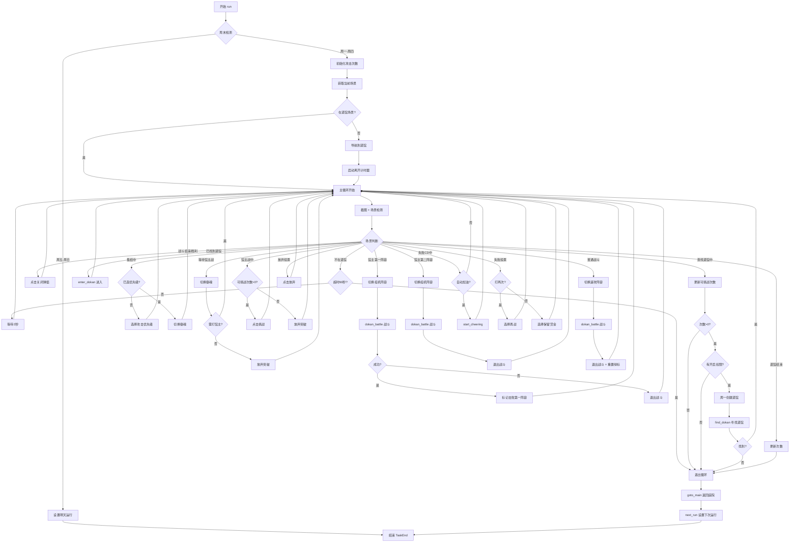
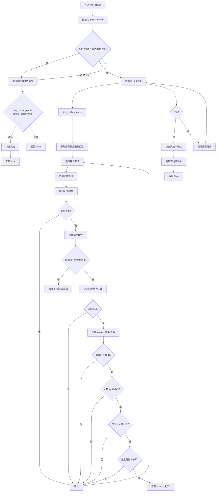
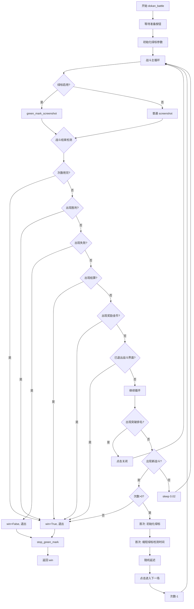

# 道馆突破 (Dokan) 任务模块 — 逐行代码详解

## 目录

- [1. 文件概述与架构说明](#1-文件概述与架构说明)
- [2. 配置参数说明 (config.py)](#2-配置参数说明-configpy)
- [3. 资源定义说明 (assets.py)](#3-资源定义说明-assetspy)
- [4. 场景检测 (dokan_scene.py)](#4-场景检测-dokan_scenepy)
- [5. 核心代码逐行解释 (script_task.py)](#5-核心代码逐行解释-script_taskpy)
- [6. 绿标扩展模块 (ex_green_mark.py)](#6-绿标扩展模块-ex_green_markpy)
- [7. 工具函数 (utils.py)](#7-工具函数-utilspy)
- [8. 任务执行流程图](#8-任务执行流程图)
- [9. 设计模式总结](#9-设计模式总结)

---

## 1. 文件概述与架构说明

### 1.1 模块职责

道馆突破模块是阴阳师自动化脚本中最复杂的任务模块，负责自动完成阴阳寮道馆突破的全流程：寻找道馆 → 进入道馆 → 集结 → 战斗（普通/馆主）→ 加油 → 投票 → 结算。

### 1.2 文件清单

| 文件 | 行数 | 职责 |
|------|------|------|
| `script_task.py` | 1182 | 主任务脚本，包含所有业务逻辑 |
| `config.py` | 180 | 配置模型定义（Pydantic） |
| `assets.py` | 192 | UI 资源定义（图片/点击/OCR/滑动） |
| `dokan_scene.py` | 146 | 场景枚举与场景检测器 |
| `ex_green_mark.py` | 434 | 绿标功能扩展（式神标记） |
| `utils.py` | 208 | 工具函数（重试、安全区域检测） |

### 1.3 架构图

```
┌─────────────────────────────────────────────────────────────────┐
│                         ScriptTask                              │
│  (主任务类，继承自 ExtendGreenMark, GameUi, SwitchSoul,          │
│   DokanSceneDetector)                                           │
├─────────────────────────────────────────────────────────────────┤
│  run()              — 主循环，状态机驱动                         │
│  find_dokan()       — 道馆选择算法                               │
│  dokan_battle()     — 战斗控制                                   │
│  goto_dokan_scene() — 导航到道馆场景                             │
│  next_run()         — 下次运行时间调度                           │
└─────────┬──────────┬──────────┬──────────┬──────────────────────┘
          │          │          │          │
    ┌─────▼───┐ ┌────▼────┐ ┌──▼───┐ ┌───▼──────────┐
    │DokanScene│ │ Dokan   │ │Assets│ │ExtendGreenMark│
    │ Detector │ │ Config  │ │      │ │(绿标扩展)     │
    └─────────┘ └─────────┘ └──────┘ └──────────────┘
          │          │          │
    ┌─────▼───┐ ┌────▼────┐ ┌──▼───┐
    │DokanScene│ │Pydantic │ │Rule* │
    │  (Enum)  │ │ Models  │ │资源  │
    └─────────┘ └─────────┘ └──────┘
```

### 1.4 继承关系

```python
class ScriptTask(
    ExtendGreenMark,    # 绿标功能扩展
    GameUi,             # 游戏界面导航
    SwitchSoul,         # 御魂切换
    DokanSceneDetector  # 场景检测
):
```

多继承设计使得 `ScriptTask` 能够组合多个功能模块的能力：
- **GameUi**: 提供页面导航（`ui_goto`, `ui_get_current_page`）
- **SwitchSoul**: 提供御魂/阵容切换功能
- **DokanSceneDetector**: 提供场景识别能力（`get_current_scene`）
- **ExtendGreenMark**: 提供增强的绿标功能（式神标记）

---

## 2. 配置参数说明 (config.py)

### 2.1 AttackDokanMasterType — 馆主攻击策略枚举

```python
class AttackDokanMasterType(str, Enum):
    ATTACK_ZERO_ZERO = "ATTACK_ZERO_ZERO"  # 不打馆主 (0)
    ATTACK_ZERO_ONE  = "ATTACK_ZERO_ONE"   # 第二次打一次馆主 (1)
    ATTACK_ZERO_TWO  = "ATTACK_ZERO_TWO"   # 第一次不打，第二次打一次 (2)
    ATTACK_ONE_ZERO  = "ATTACK_ONE_ZERO"   # 第一次打一次馆主 (3)
    ATTACK_ONE_ONE   = "ATTACK_ONE_ONE"    # 每次各打一次 (4)
    ATTACK_ONE_TWO   = "ATTACK_ONE_TWO"    # 第一次一次，第二次两次 (5)
    ATTACK_TWO_TWO   = "ATTACK_TWO_TWO"    # 每次都打两次 (8)
```

**编码规则**：名称格式为 `ATTACK_X_Y`，X 表示第一次道馆打馆主次数，Y 表示第二次。`__int__()` 方法将枚举转为数字用于计算。

`attack_dokan_master_count()` 方法根据当前是第几次道馆突破，返回本次应攻击馆主的次数：
- 只打一次道馆：`int(value) // 3`
- 打两次道馆且在第二次：`int(value) % 3`

### 2.2 AttackAccountConfig — 攻击次数配置

| 字段 | 类型 | 默认值 | 说明 |
|------|------|--------|------|
| `remain_attack_count` | int | 2 | 当天剩余可攻击次数（运行时状态） |
| `attack_date` | str | '2023-01-01' | 记录日期（运行时状态） |
| `daily_attack_count` | int | 2 | 每日最大攻击次数（1-2） |
| `attack_dokan_master` | Enum | ATTACK_TWO_TWO | 馆主攻击策略 |

**关键方法**：
- `init_attack_count()`: 每日初始化，若日期不匹配则重置为2
- `attack_dokan_master_count()`: 计算当前应打馆主的次数
- `set_attack_count()` / `del_attack_count()`: 更新剩余次数并持久化

### 2.3 DokanConfig — 道馆核心配置

| 字段 | 类型 | 默认值 | 说明 |
|------|------|--------|------|
| `dokan_attack_priority` | int | 0 | 攻击优先顺序（0=见习, 1=初级...4=黑脸） |
| `dokan_auto_cheering_while_cd` | bool | False | 失败CD后是否自动加油 |
| `random_delay` | bool | False | 进攻前随机延迟2-10秒（防检测） |
| `anti_detect_click_fixed_random_area` | bool | False | 是否使用固定安全区域随机点击 |
| `monday_to_thursday` | bool | True | 仅周一到周四开启道馆 |
| `try_start_dokan` | bool | False | 是否尝试开启道馆（需寮管理权限） |
| `find_dokan_score` | float | 4.6 | 道馆选择系数阈值（赏金/人数） |
| `min_people_num` | int | -1 | 最小防守人数限制 |
| `min_bounty` | int | 0 | 最少赏金限制 |
| `find_dokan_refresh_count` | int | 7 | 最大刷新道馆列表次数 |
| `switch_preset_enable` | bool | False | 是否切换预设阵容 |
| `preset_group_1` | str | "" | 速攻阵容（格式: "组,队"） |
| `preset_group_2` | str | "" | 挂机阵容 |
| `green_mark_shikigami_name` | str | "" | 绿标式神名称（逗号分隔） |

### 2.4 Dokan — 顶层配置类

```python
class Dokan(ConfigBase):
    scheduler: Scheduler                    # 调度器配置
    dokan_config: DokanConfig               # 道馆核心配置
    general_battle_config: GeneralBattleConfig  # 通用战斗配置
    switch_soul_config: SwitchSoulConfig    # 御魂切换配置
    attack_count_config: AttackAccountConfig # 攻击次数配置
```

---

## 3. 资源定义说明 (assets.py)

### 3.1 资源类型

| 类型 | 类 | 用途 |
|------|-----|------|
| 点击区域 | `RuleClick` | 定义可点击的屏幕区域 |
| 图片模板 | `RuleImage` | 通过模板匹配识别UI元素 |
| OCR文字 | `RuleOcr` | 通过OCR识别屏幕文字 |
| 滑动手势 | `RuleSwipe` | 定义滑动操作 |
| 列表检测 | `RuleList` | 检测列表中的文字项 |

### 3.2 关键资源分类

#### 3.2.1 安全点击区域（防检测用）

| 资源名 | ROI | 说明 |
|--------|-----|------|
| `C_DOKAN_RANDOM_CLICK_AREA` | (142,294,107,150) | 随机安全区域1 |
| `C_DOKAN_RANDOM_CLICK_AREA1` | (42,594,10,30) | 竂友突破信息区域 |
| `C_DOKAN_RANDOM_CLICK_AREA2` | (1122,360,10,40) | 切换队伍模式区域 |
| `C_DOKAN_RANDOM_CLICK_AREA3` | (333,44,107,20) | 顶部安全区域 |

#### 3.2.2 场景状态识别图片

| 资源名 | 说明 | 匹配阈值 |
|--------|------|----------|
| `I_RYOU_DOKAN_FINDING_DOKAN` | 正在查找道馆 | 0.8 |
| `I_RYOU_DOKAN_FOUND_DOKAN` | 已选择道馆 | 0.8 |
| `I_RYOU_DOKAN_GATHERING` | 集结等待中 | 0.85 |
| `I_RYOU_DOKAN_START_CHALLENGE` | 右下角挑战按钮 | 0.8 |
| `I_RYOU_DOKAN_CD` | 失败CD中（观战按钮） | 0.8 |
| `I_RYOU_DOKAN_IN_FIELD` | 进入战场待开始 | 0.8 |
| `I_DOKAN_BOSS_WAITING` | 馆主战等待中 | 0.8 |
| `I_RYOU_DOKAN_BATTLE_MASTER_FIRST` | 馆主第一阵容 | 0.8 |
| `I_RYOU_DOKAN_BATTLE_MASTER_SECOND` | 馆主第二阵容 | 0.8 |
| `I_RYOU_DOKAN_WIN` | 道馆胜利 | 0.8 |
| `I_RYOU_DOKAN_FINISHED` | 道馆已结束 | 0.8 |

#### 3.2.3 优先攻击选项

| 资源名 | 说明 |
|--------|------|
| `I_RYOU_DOKAN_ATTACK_PRIORITY` | 优先攻击选项按钮 |
| `I_RYOU_DOKAN_ATTACK_PRIORITY_0` | 见习 |
| `I_RYOU_DOKAN_ATTACK_PRIORITY_1` | 初级 |
| `I_RYOU_DOKAN_ATTACK_PRIORITY_2` | 中级 |
| `I_RYOU_DOKAN_ATTACK_PRIORITY_3` | 高级 |
| `I_RYOU_DOKAN_ATTACK_PRIORITY_4` | 黑脸 |

#### 3.2.4 OCR资源

| 资源名 | 模式 | 说明 |
|--------|------|------|
| `O_DOKAN_MAP` | Full | 道馆地图中识别"万"字定位道馆 |
| `O_DOKAN_GATHERING` | Single | 识别"开战"文字 |
| `O_DOKAN_ATTACKING` | Single | 识别"剩余"突破时间 |
| `O_DOKAN_BOSS_WAITING` | Single | 识别"馆主"文字 |
| `O_DOKAN_RIGHTPAD_BOUNTY` | Single | 右侧赏金金额 |
| `O_DOKAN_CENTER_PEOPLE_NUMBER` | Full | 中间防守人数 |
| `O_DOKEN_FAIL_CD` | Full | 失败CD倒计时秒数 |

---

## 4. 场景检测 (dokan_scene.py)

### 4.1 DokanScene 枚举

定义了道馆流程中所有可能的场景状态：

```python
class DokanScene(Enum):
    RYOU_DOKAN_SCENE_UNKNOWN = 0          # 未知界面
    RYOU_DOKAN_SCENE_GATHERING = 1        # 集结中
    RYOU_DOKAN_SCENE_IN_FIELD = 2         # 进入战场待开始
    RYOU_DOKAN_SCENE_START_CHALLENGE = 3  # 可重新挑战
    RYOU_DOKAN_SCENE_CD = 4               # 失败CD中
    RYOU_DOKAN_SCENE_FIGHTING = 5         # 战斗进行中
    RYOU_DOKAN_SCENE_BATTLE_MASTER_FIRST = 6   # 馆主第一阵容
    RYOU_DOKAN_SCENE_BATTLE_MASTER_SECOND = 7  # 馆主第二阵容
    RYOU_DOKAN_SCENE_CHEERING = 8         # 加油中
    RYOU_DOKAN_SCENE_ABANDON_VOTE = 9     # 放弃突破投票
    RYOU_DOKAN_SCENE_FAILED_VOTE = 10     # 失败后投票
    RYOU_DOKAN_RYOU = 11                  # 阴阳寮界面
    RYOU_DOKAN_SCENE_BATTLE_OVER = 12     # 战斗结算
    RYOU_DOKAN_SCENE_BOSS_WAITING = 13    # 等待馆主战
    RYOU_DOKAN_SCENE_MASTER_BATTLING = 14 # 馆主战进行中
    RYOU_DOKAN_SCENE_TOPPA_RANK = 15      # 突破排名弹窗
    RYOU_DOKAN_SCENE_WIN = 16             # 道馆胜利
    RYOU_DOKAN_SHENSHE = 17               # 神社界面
    RYOU_DOKAN_SCENE_FINDING_DOKAN = 97   # 查找道馆中
    RYOU_DOKAN_SCENE_FOUND_DOKAN = 98     # 已选择道馆
    RYOU_DOKAN_SCENE_FINISHED = 99        # 道馆结束
```

### 4.2 DokanSceneDetector — 场景检测器

```python
class DokanSceneDetector(DokanAssets, BaseTask, GeneralBattleAssets):
    def get_current_scene(self, reuse_screenshot=True) -> tuple[bool, DokanScene]:
```

**返回值**：`(in_dokan: bool, scene: DokanScene)`
- `in_dokan=True`: 当前处于道馆相关场景（从道馆地图开始的所有后续界面）
- `in_dokan=False`: 处于一般界面（庭院、寮、神社等）

**检测优先级**（从高到低）：

```
1. 阴阳寮界面 → (False, RYOU_DOKAN_RYOU)
2. 神社界面 → (False, RYOU_DOKAN_SHENSHE)
3. 查找道馆中 → (True, FINDING_DOKAN)
4. 已选择道馆 → (True, FOUND_DOKAN)
5. 集结中 → (True, GATHERING)
6. 等待馆主战 → (True, BOSS_WAITING)
7. 馆主战中+可挑战 → (True, MASTER_BATTLING)
8. 馆主第一阵容+准备按钮 → (True, BATTLE_MASTER_FIRST)
9. 馆主第二阵容+准备按钮 → (True, BATTLE_MASTER_SECOND)
10. 失败CD中 → (True, CD)
11. 可挑战按钮 → (True, START_CHALLENGE)
12. 进入战场 → (True, IN_FIELD)
13. 战斗结算 → (True, BATTLE_OVER)
14. 突破排名弹窗 → (True, TOPPA_RANK)
15. 放弃突破投票 → (True, ABANDON_VOTE)
16. 失败后投票 → (True, FAILED_VOTE)
17. 胜利/战利品 → (True, WIN)
18. 道馆已结束 → (True, FINISHED)
```

**设计要点**：检测顺序很重要，因为某些场景可能同时满足多个条件（如馆主战中同时有挑战按钮），需要将更具体的场景放在前面检测。

---

## 5. 核心代码逐行解释 (script_task.py)

### 5.1 类定义与属性

```python
class ScriptTask(ExtendGreenMark, GameUi, SwitchSoul, DokanSceneDetector):
    medal_grid: ImageGrid = None              # 勋章网格（未使用）
    attack_priority_selected: bool = False     # 是否已选择攻击优先级
    team_switched: bool = False                # 是否已切换队伍
    green_mark_done: bool = False              # 是否已完成绿标
    switch_soul_done: bool = False             # 是否已完成御魂切换
```

**缓存属性**：
```python
@cached_property
def _attack_priorities(self) -> list:
    """缓存5个优先攻击选项的资源引用，避免重复创建"""
    return [self.I_RYOU_DOKAN_ATTACK_PRIORITY_0,
            self.I_RYOU_DOKAN_ATTACK_PRIORITY_1,
            self.I_RYOU_DOKAN_ATTACK_PRIORITY_2,
            self.I_RYOU_DOKAN_ATTACK_PRIORITY_3,
            self.I_RYOU_DOKAN_ATTACK_PRIORITY_4]
```

### 5.2 run() — 主函数（状态机核心）

`run()` 是整个道馆任务的入口，采用**有限状态机**模式，通过 `while` 循环不断检测当前场景并执行对应动作。

#### 5.2.1 初始化阶段（第54-93行）

```python
def run(self):
    cfg: Dokan = self.config.dokan           # 获取道馆配置
    attack_priority: int = cfg.dokan_config.dokan_attack_priority  # 攻击优先级

    # 周末检测：若配置了周一到周四，则周五及以后跳过
    if cfg.dokan_config.monday_to_thursday:
        if datetime.now().weekday() >= 4:    # 0=周一, 4=周五
            logger.warning("weekend, exit")
            self.next_run(True)              # 设置明天再运行
            return

    # 初始化攻击次数（从配置文件读取，若无当天记录则重置）
    cfg.attack_count_config.init_attack_count(callback=self.config.save)

    is_dokan_activated = True                # 道馆是否已开启

    # 进入道馆场景
    in_dokan, current_scene = self.get_current_scene(True)
    out_dokan_timer = Timer(60)              # 离开道馆场景计时器（60秒超时）
    if not in_dokan:
        out_dokan_timer.start()
        self.goto_dokan_scene()              # 导航到道馆场景

    first_master_killed = False              # 是否已击败馆主第一阵容
```

**设计要点**：
- 使用 `out_dokan_timer` 防止长时间不在道馆场景导致死循环
- `first_master_killed` 标记用于处理馆主两阵容的战斗逻辑

#### 5.2.2 主循环（第98-305行）

```python
    while is_dokan_activated:
        self.screenshot()                    # 截图
        in_dokan, current_scene = self.get_current_scene(True)  # 检测场景
```

**场景处理分支**（按优先级排列）：

**① 不在道馆场景（第106-115行）**
```python
        if not in_dokan:
            if not out_dokan_timer.started():
                out_dokan_timer.start()
            if out_dokan_timer.reached():    # 超过60秒不在道馆
                logger.warning("long hours away from dokan,exit")
                break
            sleep(2)                         # 等待2秒后重试
            continue
        out_dokan_timer.clear()              # 回到道馆场景，清除计时器
```

**② 战斗结束 / 胜利界面（第118-128行）**
```python
        if (current_scene == DokanScene.RYOU_DOKAN_SCENE_BATTLE_OVER or
                current_scene == DokanScene.RYOU_DOKAN_SCENE_WIN):
            self.click(self.C_DOKAN_TOPPA_RANK_CLOSE_AREA, interval=2)
            sleep(2)
            continue

        if current_scene == DokanScene.RYOU_DOKAN_SCENE_TOPPA_RANK:
            self.click(self.C_DOKAN_TOPPA_RANK_CLOSE_AREA, interval=2)
            continue
```

**③ 查找道馆中（第130-153行）**
```python
        if current_scene == DokanScene.RYOU_DOKAN_SCENE_FINDING_DOKAN:
            # 更新可挑战次数
            count = self.update_remain_attack_count()
            if count <= 0:                   # 次数用完，结束
                is_dokan_activated = True
                break

            # 检查是否有权限开启道馆
            try_start_dokan = self.config.dokan.dokan_config.try_start_dokan
            if not try_start_dokan:
                is_dokan_activated = False
                break

            # 周一尝试创建道馆
            if datetime.now().weekday() == 0:
                self.creat_dokan()

            # 寻找合适的道馆
            if not self.find_dokan(self.config.dokan.dokan_config.find_dokan_score):
                is_dokan_activated = False
                break

            self.wait_until_appear(self.I_RYOU_DOKAN_CENTER_TOP, True, 5)
            continue
```

**④ 已找到道馆 → 进入（第155-157行）**
```python
        if current_scene == DokanScene.RYOU_DOKAN_SCENE_FOUND_DOKAN:
            self.enter_dokan()
            continue
```

**⑤ 集结中（第159-171行）**
```python
        if current_scene == DokanScene.RYOU_DOKAN_SCENE_GATHERING:
            if not self.attack_priority_selected:
                self.dokan_choose_attack_priority(attack_priority=attack_priority)
                self.attack_priority_selected = True
                continue
            self.switch_soul_in_dokan()      # 切换御魂
            self.device.click_record_clear()
            self.device.stuck_record_clear()
            sleep(2)
            continue
```

**⑥ 等待馆主战（第173-183行）**
```python
        if current_scene == DokanScene.RYOU_DOKAN_SCENE_BOSS_WAITING:
            self.switch_soul_in_dokan()
            self.device.stuck_record_clear()
            # 有权限且不再打馆主 → 放弃突破
            if cfg.dokan_config.try_start_dokan and \
               cfg.attack_count_config.attack_dokan_master_count() == 0:
                self.abandoned_toppa()
            sleep(2)
            continue
```

**⑦ 馆主战进行中（第185-196行）**
```python
        if current_scene == DokanScene.RYOU_DOKAN_SCENE_MASTER_BATTLING:
            count = cfg.attack_count_config.attack_dokan_master_count()
            if (count - (1 if first_master_killed else 0)) > 0:
                self.click(self.I_RYOU_DOKAN_START_CHALLENGE, interval=2)
                continue
            if cfg.dokan_config.try_start_dokan:
                self.abandoned_toppa()       # 不再打馆主，放弃突破
            continue
```

**⑧ 可挑战状态（第198-201行）**
```python
        if current_scene == DokanScene.RYOU_DOKAN_SCENE_START_CHALLENGE:
            self.switch_soul_in_dokan()
            self.click(self.I_RYOU_DOKAN_START_CHALLENGE, interval=1)
            continue
```

**⑨ 馆主第一阵容（第203-228行）**
```python
        if current_scene == DokanScene.RYOU_DOKAN_SCENE_BATTLE_MASTER_FIRST:
            count = cfg.attack_count_config.attack_dokan_master_count()
            if count <= 0:
                self.quit_battle()           # 不需要打馆主，退出

            # 切换预设阵容（挂机阵容）
            group, team = cfg.dokan_config.parse_preset_group(cfg.dokan_config.preset_group_2)
            if cfg.dokan_config.switch_preset_enable and group:
                self.switch_preset_team(cfg.dokan_config.switch_preset_enable, group, team)
                self.wait_until_appear(self.I_PRESET, False, 3)

            battle_success = self.dokan_battle(cfg, count)
            if count == 1 and battle_success:
                first_master_killed = True   # 标记已击败第一阵容
                continue
            self.quit_battle()               # 失败或其他情况，退出
            continue
```

**⑩ 馆主第二阵容（第230-246行）**
```python
        if current_scene == DokanScene.RYOU_DOKAN_SCENE_BATTLE_MASTER_SECOND:
            first_master_killed = True
            if cfg.attack_count_config.attack_dokan_master_count() < 2:
                self.quit_battle()           # 只需打一次馆主
                continue
            # 切换挂机阵容
            group, team = cfg.dokan_config.parse_preset_group(cfg.dokan_config.preset_group_2)
            if cfg.dokan_config.switch_preset_enable and group:
                self.switch_preset_team(cfg.dokan_config.switch_preset_enable, group, team)
            self.dokan_battle(cfg)
            self.quit_battle()
            self.green_mark_done = False     # 重置绿标状态
            continue
```

**⑪ 普通战斗（第248-259行）**
```python
        if current_scene == DokanScene.RYOU_DOKAN_SCENE_IN_FIELD:
            # 切换速攻阵容
            group, team = cfg.dokan_config.parse_preset_group(cfg.dokan_config.preset_group_1)
            if cfg.dokan_config.switch_preset_enable and group:
                self.switch_preset_team(cfg.dokan_config.switch_preset_enable, group, team)
            self.dokan_battle(cfg)           # 执行战斗
            self.quit_battle()               # 退出战斗界面
            self.green_mark_done = False     # 重置绿标
            continue
```

**⑫ 失败CD中（第261-269行）**
```python
        if current_scene == DokanScene.RYOU_DOKAN_SCENE_CD:
            self.switch_soul_in_dokan()
            self.device.stuck_record_clear()
            if cfg.dokan_config.dokan_auto_cheering_while_cd:
                self.start_cheering()        # 自动加油
            sleep(2)
            continue
```

**⑬ 投票处理（第275-290行）**
```python
        # 放弃突破投票
        if current_scene == DokanScene.RYOU_DOKAN_SCENE_ABANDON_VOTE:
            self.click(self.I_RYOU_DOKAN_ABANDONED_TOPPA_ABANDONED)
            continue

        # 失败后投票：再战/保留赏金
        if current_scene == DokanScene.RYOU_DOKAN_SCENE_FAILED_VOTE:
            if cfg.attack_count_config.daily_attack_count == 2:
                # 打两次的，第一次选择继续挑战
                if self.appear(self.I_RYOU_DOKAN_FAILED_VOTE_BATTLE_AGAIN):
                    self.ui_click_until_disappear(self.I_RYOU_DOKAN_FAILED_VOTE_BATTLE_AGAIN)
            else:
                # 打一次的，选择保留赏金
                if self.appear(self.I_RYOU_DOKAN_FAILED_VOTE_KEEP_BOUNTY):
                    self.ui_click_until_disappear(self.I_RYOU_DOKAN_FAILED_VOTE_KEEP_BOUNTY)
            continue
```

**⑭ 道馆结束（第292-297行）**
```python
        if current_scene == DokanScene.RYOU_DOKAN_SCENE_FINISHED:
            self.update_remain_attack_count()
            break
```

#### 5.2.3 收尾阶段（第307-311行）

```python
    self.goto_main()                         # 返回庭院
    self.next_run(skip_today=False, is_dokan_activated=is_dokan_activated)
    raise TaskEnd                            # 抛出任务结束异常
```

### 5.3 find_dokan() — 道馆选择算法

这是道馆模块中最复杂的函数之一，实现了智能道馆选择逻辑。

```python
def find_dokan(self, score=4.6):
    """
    寻找符合条件的道馆进行挑战。
    
    算法：
    1. 遍历当前可见的道馆列表（约4个）
    2. 对每个道馆：OCR识别赏金和防守人数
    3. 计算 score = 赏金 / 人数
    4. 选择 score <= 阈值 且 人数 >= 最小值 且 赏金 >= 最小值 的道馆
    5. 若当前列表无合适道馆，刷新列表重试
    6. 刷新次数用完后，选择系数最低的道馆
    """
```

#### 5.3.1 内部函数 find_challengeable()

```python
def find_challengeable(ignore_score=False):
    """
    在当前列表中查找符合条件的道馆。
    
    参数:
        ignore_score: True时忽略系数限制，选择系数最低的
    """
    restore_roi()                            # 恢复ROI到初始状态
    self.screenshot()
    
    # 查找所有赏金图标位置（右侧边栏）
    bounty_list = self.find_all_element(self.I_RIGHTPAD_POINT_BOUNTY, (0, 0, 0, 50))
    
    min_score = 10                           # 记录最低分数
    idx_selected = -1                        # 记录最低分数的索引
    
    for idx, item in enumerate(bounty_list):
        # 1. 先取消之前的选择（隐藏挑战按钮）
        while self.appear(self.I_CENTER_CHALLENGE):
            self.click(self.C_DOKAN_CANCEL_SELECT_DOKAN, interval=1.5)
            self.wait_animate_stable(...)

        # 2. OCR识别赏金金额
        self.O_DOKAN_RIGHTPAD_BOUNTY.roi = self.position_offset(item, (0, 0, 100, 0))
        bounty = self.O_DOKAN_RIGHTPAD_BOUNTY.ocr(self.device.image)
        bounty = float(re.search(r'(\d+)', bounty).group())

        # 3. 点击道馆显示详情卡片（带8秒超时）
        if not self.ui_click_until_appear_or_timeout(
            self.I_RIGHTPAD_POINT_BOUNTY, self.I_CENTER_CHALLENGE, timeout=8):
            continue                         # 道馆不可挑战（被其他寮打了）

        # 4. OCR识别防守人数
        p_num = self.O_DOKAN_CENTER_PEOPLE_NUMBER.detect_text(self.device.image)
        p_num = float(re.search(r"(\d+)", p_num).group())

        # 5. 计算系数并判断
        item_score = bounty / p_num
        if item_score < min_score:
            min_score = item_score
            idx_selected = idx

        # 过滤条件
        if item_score > score or item_score < 1.5:  # 系数过大或OCR错误
            continue
        if p_num < self.config.dokan.dokan_config.min_people_num:  # 人数太少
            continue
        if bounty < self.config.dokan.dokan_config.min_bounty:     # 赏金太少
            continue
        if not self.appear(self.I_CENTER_GUANZHU_XIUXI):          # 馆主非修习等级
            continue

        return True                          # 找到符合条件的道馆

    # 忽略系数限制时，选择最低系数的
    if ignore_score:
        x, y, w, h = bounty_list[idx_selected]
        while 1:
            self.screenshot()
            if self.appear(self.I_CENTER_CHALLENGE):
                return True
            self.device.click(x, y)
            sleep(0.5)
    return False
```

#### 5.3.2 主循环

```python
while num_fresh < self.config.dokan.dokan_config.find_dokan_refresh_count:
    for i in range(3):                       # 每次刷新后最多滑动3次
        sleep(3)
        if find_challengeable():
            # 找到了，点击挑战并确认
            self.ui_click(self.I_CENTER_CHALLENGE, self.I_CHALLENGE_ENSURE, interval=1)
            self.ui_click_until_disappear(self.I_CHALLENGE_ENSURE, interval=1)
            self.config.dokan.attack_count_config.del_attack_count(1, self.config.save)
            restore_roi()
            return True
        self.swipe(self.S_DOKAN_LIST_UP)     # 滑动查看更多道馆

    # 刷新道馆列表
    self.ui_click(self.C_DOKAN_REFRESH, self.I_REFRESH_ENSURE, interval=1)
    self.ui_click_until_disappear(self.I_REFRESH_ENSURE, interval=1)
    num_fresh += 1

# 刷新次数用完，选择系数最低的
if find_challengeable(ignore_score=True):
    self.ui_click(self.I_CENTER_CHALLENGE, self.I_CHALLENGE_ENSURE, interval=1)
    self.ui_click_until_disappear(self.I_CHALLENGE_ENSURE, interval=1)
    self.config.dokan.attack_count_config.del_attack_count(1, self.config.save)
    return True
return False
```

### 5.4 dokan_battle() — 战斗控制

```python
def dokan_battle(self, cfg: Dokan, battle_count_limit=None):
    """
    道馆战斗主函数。
    
    流程：
    1. 等待准备按钮出现
    2. 循环检测战斗状态
    3. 检测到新战斗 → 点击进入 → 绿标标记
    4. 检测到胜利/失败 → 返回结果
    """
```

#### 5.4.1 初始化

```python
    battle_config: GeneralBattleConfig = cfg.general_battle_config
    if not battle_count_limit:
        battle_count_limit = 999             # 默认不限制

    self.screenshot()
    win = False

    self.wait_until_appear(self.I_PREPARE_HIGHLIGHT)  # 等待准备按钮

    need_green_mark = battle_config.green_enable       # 是否需要绿标
    need_init_green_mark_area = battle_config.green_enable  # 是否需要初始化绿标区域
```

#### 5.4.2 战斗主循环

```python
    while True:
        # 根据是否启用绿标选择截图方式
        if cfg.general_battle_config.green_enable:
            self.green_mark_screenshot(anti_wait_long_time)
        else:
            self.screenshot()

        # 内部函数：判断战斗是否结束
        def is_battle_end() -> (bool, bool):
            if battle_count_limit < 0:       # 战斗次数用完
                return True, True
            if self.appear(GeneralBattle.I_WIN):      # 通用胜利
                return True, True
            if self.appear(self.I_RYOU_DOKAN_WIN):    # 馆主战胜利
                return True, True
            if self.appear(GeneralBattle.I_FALSE):    # 失败
                return False, True
            if self.appear(self.I_RYOU_DOKAN_BATTLE_OVER, threshold=0.6):  # 战斗结算
                return True, True
            if self.appear(GeneralBattle.I_REWARD_GOLD):  # 奖励金币
                return True, True
            if self.appear(self.I_RYOU_DOKAN_CENTER_TOP):  # 已退出战斗
                return True, True
            return False, False

        win, is_battle_end_and_exit = is_battle_end()
        if is_battle_end_and_exit:
            break

        # 关闭突破排名弹窗
        if self.appear(self.I_RYOU_DOKAN_TOPPA_RANK):
            self.click(self.C_DOKAN_TOPPA_RANK_CLOSE_AREA, interval=2)
            continue

        # 随机滑动（防检测），但启用绿标时禁止
        if battle_config.random_click_swipt_enable and not battle_config.green_enable:
            self.random_click_swipt()

        # 打完一个对手，自动进入下一个
        if self.appear(self.I_RYOU_DOKAN_IN_FIELD):
            if battle_count_limit <= 0:
                win = True
                break

            # 初始化绿标区域（仅首次）
            if need_init_green_mark_area:
                need_init_green_mark_area = False
                self.init_green_mark_from_cfg(
                    self.config.dokan.dokan_config.green_mark_shikigami_name,
                    self.config.dokan.general_battle_config.green_mark)

            # 首次绿标：缩短检测时间
            if need_green_mark:
                need_green_mark = False
                self.set_disappear_count(self.MAX_DISAPPEAR_COUNT - 10)

            # 随机延迟（防检测）
            if cfg.dokan_config.random_delay:
                self.anti_detect(False, False, True)

            self.ui_click_until_disappear(self.I_RYOU_DOKAN_IN_FIELD, interval=0.4)
            anti_wait_long_time()
            battle_count_limit -= 1
            continue

        sleep(0.02)

    self.stop_green_mark()
    return win
```

### 5.5 dokan_battle_1() — 旧版战斗函数

`dokan_battle_1()` 是早期版本的战斗实现，与 `dokan_battle()` 功能类似但缺少绿标集成。主要区别：

- 不使用 `green_mark_screenshot()` 
- 绿标使用 `ex_green_mark_3_retry()` 方法
- 逻辑更简单，但功能不完整

### 5.6 辅助函数详解

#### 5.6.1 goto_dokan_scene() — 导航到道馆

```python
def goto_dokan_scene(self):
    self.device.screenshot_interval_set(0.3)  # 设置截图间隔防止循环
    while 1:
        self.screenshot()
        in_dokan, cur_scene = self.get_current_scene()
        if in_dokan:                          # 已到达道馆
            break
        if cur_scene == DokanScene.RYOU_DOKAN_RYOU:      # 在阴阳寮
            self.ui_click_until_disappear(self.I_RYOU_SHENSHE)  # 点击神社
            continue
        if cur_scene == DokanScene.RYOU_DOKAN_SHENSHE:   # 在神社
            self.ui_click_until_disappear(self.I_RYOU_DOKAN)    # 点击道馆
            continue
        if not in_dokan:                      # 在其他界面
            self.ui_get_current_page()
            self.ui_goto(page_guild)          # 导航到阴阳寮
            continue
    self.device.screenshot_interval_set()     # 恢复默认截图间隔
```

**导航路径**：庭院 → 阴阳寮 → 神社 → 道馆

#### 5.6.2 enter_dokan() — 进入道馆

```python
def enter_dokan(self):
    try_count = 0
    while try_count < 5:
        self.screenshot()
        _, cur_scene = self.get_current_scene()
        if cur_scene != DokanScene.RYOU_DOKAN_SCENE_FOUND_DOKAN:
            return False                     # 场景已变化

        # OCR识别地图上的"万"字（道馆位置标识）
        pos = self.O_DOKAN_MAP.ocr_full(self.device.image)
        if pos == (0, 0, 0, 0):
            logger.info(f"failed to find {self.O_DOKAN_MAP.keyword}")
        else:
            x = pos[0] + pos[2] / 2          # 取文字中心X
            y = pos[1] - 20                   # 往上偏移20像素
            self.device.click(x=x, y=y)

        try_count += 1
        time.sleep(1)
    return True
```

#### 5.6.3 start_cheering() — 自动加油

```python
def start_cheering(self):
    # 1. OCR识别CD剩余秒数
    cd_text = self.O_DOKEN_FAIL_CD.detect_text(self.device.image)
    remain_seconds = int(re.search(r'\d+', cd_text).group())

    # 2. 设置加油计时器
    cheering_timer = Timer(remain_seconds).start()

    # 3. 进入观战
    while not cheering_timer.reached():
        self.screenshot()
        if self.appear_then_click(self.I_RYOU_DOKAN_CD, interval=2.5):  # 点击观战
            sleep(1)
            continue
        if self.list_appear_click(self.L_GOTO_CHEERING, interval=3, max_swipe=3):  # 点击前往
            break
        self.click(random_click(), interval=5)  # 随机点击关闭弹窗

    # 4. 执行助威
    cheer_cnt = 0
    while not cheering_timer.reached():
        self.screenshot()
        # 战斗结束，返回
        if self.appear(self.I_RYOU_DOKAN_WIN) or self.appear(self.I_FALSE) or \
           self.appear(self.I_RYOU_DOKAN_TOPPA_RANK):
            return
        # 灰色助威（冷却中）
        if self.is_in_battle(False) and self.appear(self.I_RYOU_DOKAN_CHEERING_GRAY):
            continue
        # 亮色助威（可点击）
        if self.is_in_battle(False) and self.appear_then_click(self.I_RYOU_DOKAN_CHEERING):
            cheer_cnt += 1
            continue
        sleep(random.uniform(0.8, 1.6))

    self.exit_battle()                       # 时间到，退出观战
```

#### 5.6.4 next_run() — 下次运行调度

```python
def next_run(self, skip_today=False, is_dokan_activated=False):
    """
    调度逻辑：
    - skip_today=True: 设置为明天服务器时间运行
    - 道馆未开启:
      - 当前时间 < 服务器时间: 设置为今天服务器时间
      - 超过服务器时间2小时: 当作成功，明天运行
      - 其他: 失败间隔后重试
    - 道馆已开启:
      - 打两次且当前是第一次: 失败间隔后运行
      - 其他: 当作成功，明天运行
    """
```

#### 5.6.5 switch_soul_in_dokan() — 道馆内切换御魂

```python
def switch_soul_in_dokan(self):
    if self.switch_soul_done:
        return                               # 已切换过，跳过
    self.ui_click_until_disappear(self.I_RYOU_DOKAN_SHIKIGAMI, interval=2)  # 打开式神录

    if self.config.dokan.switch_soul_config.enable:
        self.run_switch_soul(...)            # 按组队切换
    if self.config.dokan.switch_soul_config.enable_switch_by_name:
        self.run_switch_soul_by_name(...)    # 按名称切换

    self.switch_soul_done = True
    self.ui_click_until_disappear(gua.I_BACK_Y, interval=2)  # 返回道馆
```

#### 5.6.6 find_all_element() — 查找所有匹配元素

```python
def find_all_element(self, item, offset: tuple) -> list[tuple[int, int, int, int]]:
    """
    在屏幕中垂直方向查找所有匹配的元素。
    
    算法：
    1. 从当前位置开始查找
    2. 找到后，将搜索区域下移到该元素底部
    3. 继续查找直到超出屏幕范围
    """
    res_list = []
    while 1:
        # 边界检查
        if (item.roi_back[0] + item.roi_back[2] > (1280 + offset[2])) or \
           (item.roi_back[1] + item.roi_back[3] > (720 + offset[3])):
            break
        if self.appear(item):
            res_list.append(item.roi_front.copy())
            # 更新搜索区域：从当前元素底部开始
            item.roi_back = self.position_offset(item.roi_back, (
                0, item.roi_front[1] + item.roi_front[3] - item.roi_back[1], 0,
                item.roi_front[3] - item.roi_back[3]))
        item.roi_back = self.position_offset(item.roi_back, offset)
    return res_list
```

---

## 6. 绿标扩展模块 (ex_green_mark.py)

### 6.1 概述

绿标功能用于在战斗中自动标记指定式神（显示绿色标记），以便队友集中火力攻击。`ExtendGreenMark` 扩展了基础的绿标功能，增加了：
- 按式神名称OCR定位
- 绿标消失检测与自动重新标记
- 绿标状态管理

### 6.2 GreenMarkState 枚举

```python
class GreenMarkState(int, Enum):
    NOT_INIT = 0    # 未初始化
    INITED = 1      # 已初始化
    MARKED = 2      # 已标记
    DISAPPEARED = 3 # 绿标已消失
```

### 6.3 核心方法

#### 6.3.1 init_green_mark_from_cfg() — 从配置初始化绿标

```python
def init_green_mark_from_cfg(self, names=None, green_mark_type=None):
    self._shikigami_name = names
    if self._shikigami_name is None or self._shikigami_name == "":
        # 使用默认位置模式（如主怪、左侧1-5号位）
        tmp = self.generate_green_mark_area(green_mark_type)
        self._green_mark_click_roi = tmp.roi_front
    else:
        # 使用OCR识别式神名称位置
        self._green_mark_click_roi = retry(
            lambda: self.detect_name_position(self.device.image, self._shikigami_name), 3)

    # 计算绿标检测区域（在点击区域基础上扩展边距）
    self._green_mark_detect_area = self.calc_green_mark_locate_area(self._green_mark_click_roi)
    self.start_green_mark()
```

#### 6.3.2 detect_name_position() — OCR识别式神名称位置

```python
def detect_name_position(self, img, names: str) -> list[int]:
    name_list = names.split(',')             # 支持多个名称
    for name in name_list:
        # 使用OCR模型检测所有文字
        res_list = self.O_EXP_50.model.detect_and_ocr(img, 0.7)
        # 模糊匹配（相似度 > 0.5）
        res = [item for item in res_list if similarity(item.ocr_text, name) > 0.5]
        res = sorted(res, key=lambda x: x.score)  # 按置信度排序
        if len(res) <= 0:
            continue
        box = res[0].box
        # 返回 [x, y, w, h] 并做位置修正
        offset = [5, 30, -10, 0]
        return [box[0,0]+offset[0], box[0,1]+offset[1],
                box[2,0]-box[0,0]+offset[2], box[2,1]-box[0,1]+offset[3]]
    return None
```

#### 6.3.3 green_mark_screenshot() — 带绿标检测的截图

```python
def green_mark_screenshot(self, callback=None):
    self.screenshot()                        # 常规截图
    if self._state == GreenMarkState.NOT_INIT:
        return self.device.image             # 未初始化，跳过检测

    # 如果需要，尝试OCR识别式神名称
    if self._green_mark_click_roi is None and self._shikigami_name:
        self._green_mark_click_roi = self.detect_name_position(...)
        if self._green_mark_click_roi:
            self._green_mark_detect_area = self.calc_green_mark_locate_area(...)

    # 检测绿标是否存在
    if self.detect_green_mark(self.device.image):
        self._disappear_count = 0
        self._disappear_timer.reset()
        self._state = GreenMarkState.MARKED
        return self.device.image

    # 绿标消失处理
    self._state = GreenMarkState.DISAPPEARED
    self._disappear_count += 1
    self._disappear_timer.start()

    # 判断是否需要重新标记
    if self.need_green_mark():
        if self.green_mark_with_area(interval=self.GREEN_MARK_INTERVAL):
            self._disappear_timer.reset()
            self._disappear_count = 0
            if callback:
                callback()
    return self.device.image
```

#### 6.3.4 detect_green_mark() — 绿标检测

```python
def detect_green_mark(self, img=None, area=None):
    def detect_green_marker_base(image):
        # 转换到HSV色彩空间
        hsv_image = cv2.cvtColor(image, cv2.COLOR_RGB2HSV)
        # 定义绿色范围
        lower_green = np.array([67, 115, 110])
        upper_green = np.array([80, 255, 232])
        # 创建掩码
        mask = cv2.inRange(hsv_image, lower_green, upper_green)
        result = cv2.bitwise_and(image, image, mask=mask)
        # 模板匹配（三个区域：左上、底部、整体）
        return (self.I_GREEN_MARKER_LEFT_TOP.match(result)
                or self.I_GREEN_MARKER_BOTTOM.match(result)
                or self.I_GREEN_MARKER.match(result))

    return detect_green_marker_base(self.device.image)
```

**设计要点**：使用HSV色彩空间过滤绿色，再用模板匹配验证，避免误检。

---

## 7. 工具函数 (utils.py)

### 7.1 retry() — 通用重试函数

```python
def retry(func, max_retry=3, *args, **kwargs):
    while True:
        try:
            result = func(*args, **kwargs)
            if result is not None or max_retry <= 0:
                return result
            max_retry -= 1
        except Exception as e:
            if max_retry <= 0:
                raise e
            max_retry -= 1
```

### 7.2 detect_safe_area2() — 安全区域检测

```python
def detect_safe_area2(image, safe_color_lower, safe_color_upper, num_areas=3, debug=False):
    """
    找出截图中最大的纯色区域，用于防检测随机点击。
    
    步骤：
    1. BGR → HSV 色彩空间转换
    2. 颜色范围过滤
    3. 形态学操作（膨胀+腐蚀）消除噪点
    4. 查找轮廓并按面积排序
    5. 返回最大轮廓的边界矩形
    """
    hsv = cv2.cvtColor(image, cv2.COLOR_BGR2HSV)
    mask = cv2.inRange(hsv, safe_color_lower, safe_color_upper)
    
    # 形态学操作
    kernel = np.ones((5, 5), np.uint8)
    mask = cv2.dilate(mask, kernel, iterations=1)
    mask = cv2.erode(mask, kernel, iterations=1)
    
    # 查找轮廓
    contours, _ = cv2.findContours(mask, cv2.RETR_EXTERNAL, cv2.CHAIN_APPROX_SIMPLE)
    
    if contours:
        safe_area = max(contours, key=cv2.contourArea)
        x, y, w, h = cv2.boundingRect(safe_area)
        return (x, y, w, h)
    return (0, 0, 0, 0)
```

### 7.3 anti_detect() — 防检测综合方案

```python
def anti_detect(self, random_move=True, random_click=True, random_delay=True):
    """
    三种防检测手段：
    1. random_move: 随机滑动（模拟手指移动）
    2. random_click: 随机点击安全区域
    3. random_delay: 随机延迟0-5秒
    """
    if random_move:
        self.random_click_swipt()
    if random_click:
        sleep_time = round(random.uniform(0, 2), 2)
        if not self.config.dokan.dokan_config.anti_detect_click_fixed_random_area:
            # 随机选择预定义的安全区域
            num = random.randint(0, 5)
            self.click(click=self._attack_priorities[num % 4], interval=sleep_time)
        else:
            # 动态检测安全区域（绿色区域）
            pos = detect_safe_area2(self.device.image, ...)
            self.click(pos)
    if random_delay:
        sleep_time = round(random.uniform(0, 5), 2)
        time.sleep(sleep_time)
```

---

## 8. 任务执行流程图

### 8.1 主流程



### 8.2 道馆选择流程 (find_dokan)



### 8.3 战斗流程 (dokan_battle)



---

## 9. 设计模式总结

### 9.1 状态机模式 (State Machine)

道馆任务的核心是**有限状态机**。`run()` 函数中的 `while` 循环不断检测当前场景（状态），并根据状态执行相应动作，然后状态转换。

```
┌─────────────┐
│ 查找道馆     │◄─────────────────────┐
│ FINDING     │                       │
└──────┬──────┘                       │
       │ 找到道馆                      │
       ▼                              │
┌─────────────┐                       │
│ 已找到道馆   │                       │
│ FOUND       │                       │
└──────┬──────┘                       │
       │ 进入                          │
       ▼                              │
┌─────────────┐                       │
│ 集结中       │                       │
│ GATHERING   │                       │
└──────┬──────┘                       │
       │ 集结完成                      │
       ▼                              │
┌─────────────┐    失败     ┌─────────┴───┐
│ 普通战斗     │───────────►│ 失败CD       │
│ IN_FIELD    │            │ CD          │
└──────┬──────┘            └──────┬──────┘
       │ 胜利                      │ CD结束
       ▼                          │
┌─────────────┐◄──────────────────┘
│ 等待馆主战   │
│ BOSS_WAIT   │
└──────┬──────┘
       │ 馆主战开始
       ▼
┌─────────────┐
│ 馆主战       │
│ MASTER      │
└──────┬──────┘
       │ 馆主被击败
       ▼
┌─────────────┐
│ 道馆结束     │
│ FINISHED    │
└─────────────┘
```

### 9.2 多继承组合模式

`ScriptTask` 通过多继承组合了4个功能模块：

```python
class ScriptTask(
    ExtendGreenMark,    # 绿标功能
    GameUi,             # UI导航
    SwitchSoul,         # 御魂切换
    DokanSceneDetector  # 场景检测
):
```

**优点**：功能模块化，职责分离，易于测试和复用。
**缺点**：菱形继承问题（Python 的 MRO 解决），方法名冲突风险。

### 9.3 模板方法模式 (Template Method)

`dokan_battle()` 定义了战斗的算法骨架：
1. 等待准备 → 2. 循环检测 → 3. 处理战斗 → 4. 返回结果

具体的战斗行为（绿标策略、阵容切换）由子步骤实现。

### 9.4 策略模式 (Strategy)

道馆选择算法 `find_dokan()` 中的 `find_challengeable()` 是一个策略：
- `ignore_score=False`: 严格模式，只选符合条件的
- `ignore_score=True`: 宽松模式，选系数最低的

### 9.5 观察者模式 (Observer) — 绿标检测

`green_mark_screenshot()` 在每次截图时自动检测绿标状态：
- 绿标存在 → 重置计数器
- 绿标消失 → 增加计数器 → 达到阈值时自动重新标记

这是一种被动检测机制，类似于观察者模式。

### 9.6 重试模式 (Retry)

多处使用重试机制处理不确定性：
- `retry()` 工具函数：通用重试
- `find_dokan()` 中的刷新循环
- `enter_dokan()` 中的OCR重试
- `dokan_choose_attack_priority()` 中的点击重试

### 9.7 资源对象模式 (Asset Object)

所有UI元素（图片、点击区域、OCR区域）都定义为类属性的资源对象：

```python
I_RYOU_DOKAN_WIN = RuleImage(roi_front=(...), roi_back=(...), threshold=0.8, ...)
C_DOKAN_RANDOM_CLICK_AREA = RuleClick(roi_front=(...), roi_back=(...), ...)
O_DOKAN_MAP = RuleOcr(roi=(...), keyword="万", ...)
```

**设计优势**：
- 声明式定义，易于维护
- ROI 可动态修改（如 `find_all_element` 中的搜索区域调整）
- 统一的 `appear()` / `click()` 接口

### 9.8 防检测策略

脚本实现了多层防检测机制：

| 层级 | 策略 | 实现 |
|------|------|------|
| 时间 | 随机延迟 | `anti_detect(random_delay=True)` |
| 点击 | 随机安全区域点击 | `anti_detect(random_click=True)` |
| 移动 | 随机滑动 | `anti_detect(random_move=True)` |
| 间隔 | 截图间隔控制 | `screenshot_interval_set()` |
| 区域 | 动态安全区域检测 | `detect_safe_area2()` |

---

## 附录：关键数据流

```
配置文件 (config.yaml)
    │
    ▼
Dokan (Pydantic Model)
    │
    ├─► scheduler          → 调度时间
    ├─► dokan_config       → 道馆参数
    ├─► general_battle_config → 战斗参数
    ├─► switch_soul_config → 御魂配置
    └─► attack_count_config → 攻击次数状态
            │
            ▼
    ScriptTask.run()
            │
            ├─► get_current_scene() → DokanScene
            ├─► find_dokan()        → 选择道馆
            ├─► dokan_battle()      → 执行战斗
            ├─► start_cheering()    → 加油助威
            └─► next_run()          → 下次调度
```
