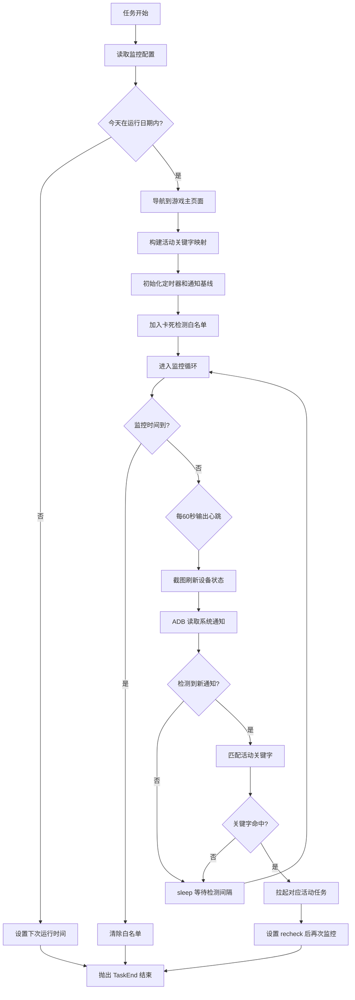

# GuildActivityMonitor 逐行代码详解

## 1. 文件概述

| 文件 | 行数 | 职责 |
|------|------|------|
| `script_task.py` | 161 | 主逻辑：日期判断、监控循环、通知检测、任务调度 |
| `config.py` | 37 | 配置模型定义：监控参数、活动开关、调度器 |
| `assets.py` | 12 | 资源占位文件（自动生成，当前无图像/点击资源） |

**功能定位**：通过 ADB 读取 Android 系统通知，检测阴阳师游戏推送的寮活动（道馆、狭间、宴会、退治），自动拉起对应任务执行。

---

## 2. 配置参数说明

### 2.1 `GuildActivityMonitorCombatTime` — 监控时间配置

| 参数 | 类型 | 默认值 | 说明 |
|------|------|--------|------|
| `detection_interval` | `int` | 30 | 通知检测间隔（秒），主循环中每次截图后的等待时间 |
| `monitor_duration` | `int` | 15 | 监控持续时间（分钟），超时后任务自动结束 |
| `recheck_interval` | `int` | 5 | 拉起活动任务后，多久再次开启监控检测（分钟） |
| `run_days` | `str` | `"1,2,3,4,5,6,7"` | 运行日期，1=周一 ~ 7=周日，逗号分隔 |

### 2.2 `GuildActivity` — 活动开关配置

| 参数 | 类型 | 默认值 | 对应活动 |
|------|------|--------|----------|
| `Dokan` | `bool` | `True` | 道馆突破 |
| `AbyssShadows` | `bool` | `True` | 狭间暗域 |
| `GuildBanquet` | `bool` | `True` | 寮宴会 |
| `DemonRetreat` | `bool` | `True` | 首领退治 |

### 2.3 `GuildActivityMonitor` — 顶层配置聚合

```python
class GuildActivityMonitor(ConfigBase):
    scheduler: Scheduler                                  # 调度器配置（继承自 ConfigBase）
    guild_activity_monitor_combat_time: GuildActivityMonitorCombatTime  # 监控时间参数
    guild_activity: GuildActivity                         # 活动开关
```

---

## 3. 资源定义说明

`assets.py` 由 `dev_tools/assets_extract.py` 自动生成，当前为空壳：

```python
class GuildActivityMonitorAssets:
    pass
```

**设计原因**：本任务不依赖图像识别（OCR/模板匹配），而是通过 ADB 命令读取系统通知，因此无需定义 `RuleImage`、`RuleClick` 等资源。文件保留是为了框架统一的任务加载机制。

---

## 4. 核心代码逐行解释

### 4.1 `script_task.py` — 导入部分 (1-8)

```python
import re                          # 正则表达式，用于解析运行日期字符串和通知文本
import time                        # time.sleep() 用于检测间隔等待
from datetime import datetime, timedelta  # 日期时间计算（下次运行时间、监控超时）
from module.base.timer import Timer        # 框架内置定时器，管理监控持续时间和日志间隔
from module.exception import TaskEnd       # 任务结束异常，用于提前终止任务并通知调度器
from module.logger import logger           # 框架日志工具
from tasks.GameUi.game_ui import GameUi    # 游戏 UI 操作基类（页面导航、截图等）
from tasks.GameUi.page import page_main    # 主页面定义，用于 ui_goto 导航
```

### 4.2 `ScriptTask` 类定义与 `run()` 方法 (11-102)

#### 4.2.1 日期判断逻辑 (13-39)

```python
class ScriptTask(GameUi):                          # 继承 GameUi，获得 UI 操作能力

    def run(self):
        monitor_config = self.config.guild_activity_monitor.guild_activity_monitor_combat_time
        # 从全局配置中读取监控时间配置对象

        now = datetime.now()                       # 获取当前时间
        today = now.weekday() + 1                  # weekday(): 0=周一 → +1 后 1=周一, 7=周日

        run_days = sorted({                        # 从字符串 "1,2,3,4,5,6,7" 提取有效日期
            day for day in map(int, re.findall(r'\d+', monitor_config.run_days))
            if 1 <= day <= 7                       # 过滤 1-7 范围外的无效值
        })
```

```python
        if not run_days:                           # 配置为空或全无效 → 跳过任务
            logger.warning(f"运行日期配置无效: {monitor_config.run_days}，跳过 GuildActivityMonitor")
            raise TaskEnd('GuildActivityMonitor')  # 抛出 TaskEnd 通知调度器任务结束

        in_run_days = today in run_days            # 今天是否在运行日期内
```

**下次运行时间计算**：

```python
        # 如果今天在运行日中，排除今天找下一个运行日；否则从所有运行日中找最近的
        candidate_days = [day for day in run_days if day != today] if in_run_days else run_days

        # 取距离今天的最小正偏移（模7处理跨周）
        delta_days = min((day - today) % 7 for day in candidate_days)

        # 如果偏移为0（今天就是最近运行日但已排除），设为7天后
        next_date = now + timedelta(days=delta_days or 7)
```

**服务器更新时间处理**：

```python
        server_update = self.config.guild_activity_monitor.scheduler.server_update
        # 判断是否自定义了服务器更新时间（非默认 09:00:00）
        use_server_time = (server_update.hour, server_update.minute, server_update.second) != (9, 0, 0)

        # 如果自定义了服务器时间，合并日期+时间；否则只用日期（时间由调度器决定）
        next_target = datetime.combine(next_date.date(), server_update) if use_server_time else next_date
```

**日志输出与调度设置**：

```python
        status = '在' if in_run_days else '不在'
        action = '本次继续执行' if in_run_days else '跳过 GuildActivityMonitor'
        logger.info(f"今天是周{today}，{status}配置运行日期({monitor_config.run_days})内，{action}，下次运行时间: {next_target}")

        # 无论是否跳过，都设置下次运行时间
        self.set_next_run(task='GuildActivityMonitor', success=None, finish=False, server=False, target=next_target)

        if not in_run_days:                        # 今天不在运行日 → 结束任务
            raise TaskEnd('GuildActivityMonitor')
```

#### 4.2.2 活动关键字映射构建 (41-53)

```python
        self.ui_get_current_page()                 # 获取当前游戏页面状态
        self.ui_goto(page_main)                    # 导航到主页面（确保游戏在前台）

        guild_config = self.config.guild_activity_monitor.guild_activity

        # 构建中文关键字 → 英文任务名的映射，仅包含已启用的活动
        KEYWORD_MAP = {
            '道馆': 'Dokan' if guild_config.Dokan else None,
            '狭间': 'AbyssShadows' if guild_config.AbyssShadows else None,
            '宴会': 'GuildBanquet' if guild_config.GuildBanquet else None,
            '退治': 'DemonRetreat' if guild_config.DemonRetreat else None,
        }
        KEYWORD_MAP = {k: v for k, v in KEYWORD_MAP.items() if v}  # 过滤掉值为 None 的项
        monitored_activities = list(KEYWORD_MAP.keys())
        logger.info(f"监控活动: {monitored_activities}")
```

#### 4.2.3 监控初始化 (55-71)

```python
        monitor_config = self.config.guild_activity_monitor.guild_activity_monitor_combat_time
        duration_minutes = monitor_config.monitor_duration      # 监控持续分钟数
        interval = monitor_config.detection_interval            # 检测间隔秒数
        logger.info(f"开始阴阳寮活动监控，持续{duration_minutes}分钟，每{interval}秒检测一次")

        check_timer = Timer(monitor_config.monitor_duration * 60)  # 总监控时长定时器（转为秒）
        check_timer.start()
        log_timer = Timer(60)                                      # 每60秒输出一次心跳日志
        log_timer.start()

        init_time, _ = self.get_notification_info()  # 获取初始通知时间戳，用于后续判断"新通知"

        # 将 'PAUSE' 加入卡死检测白名单
        # 监控任务大部分时间在 sleep，会被全局卡死检测误判
        self.device.stuck_record_add('PAUSE')
```

#### 4.2.4 主监控循环 (73-102)

```python
        try:
            while True:                            # 无限循环，直到超时或检测到通知
                if check_timer.reached():          # 监控时间到 → 结束任务
                    logger.info("监控时间到，任务结束")
                    raise TaskEnd('GuildActivityMonitor')

                if log_timer.reached():            # 每60秒输出剩余时间心跳
                    remaining = int(check_timer.remain() // 60)
                    logger.info(f"监控中... 剩余时间: {remaining}分钟")
                    log_timer.reset()

                self.screenshot()                  # 截图（虽然本任务不用图像识别，但截图会刷新设备状态）

                # 读取系统通知
                current_time, notification_text = self.get_notification_info()

                # 判断是否为新通知（时间戳 > 初始时间）且包含有效活动文本
                if current_time > init_time and notification_text:
                    logger.info(f"检测到新通知: {notification_text}")

                    for keyword, task_name in KEYWORD_MAP.items():
                        if keyword in notification_text:        # 关键字匹配
                            logger.info(f"检测到关键字 '{keyword}'，启动任务: {task_name}")

                            # 立即拉起对应活动任务（target=now 表示立即执行）
                            self.set_next_run(task=task_name, success=False, finish=False, server=False, target=datetime.now())

                            # 设置监控任务在 recheck_interval 分钟后再次运行
                            recheck_interval = monitor_config.recheck_interval
                            self.set_next_run(task='GuildActivityMonitor', success=False, finish=False, server=False,
                                              target=datetime.now() + timedelta(minutes=recheck_interval))

                            raise TaskEnd('GuildActivityMonitor')  # 结束当前监控，让调度器拉起活动任务

                time.sleep(interval)               # 等待检测间隔

        finally:
            self.device.stuck_record_clear()       # 无论正常/异常退出，都清除卡死白名单
```

### 4.3 `get_notification_info()` 方法 (104-140)

```python
    def get_notification_info(self) -> tuple:
        try:
            # 通过 ADB 执行 dumpsys 命令获取所有系统通知（不脱敏）
            output = self.device.adb_shell(['dumpsys', 'notification', '--noredact'])

            notification_time = 0
            notification_text = ""

            # 正则匹配所有通知块：每个块以 when=<时间戳> 开头
            # (整个块文本, 时间戳字符串) 的元组列表
            notification_blocks = re.findall(r'(when=(\d+)[\s\S]*?(?=when=|\Z))', output)

            if notification_blocks:
                latest_block_time = 0              # 追踪最新通知的时间戳
                latest_text = ""                   # 追踪最新通知的活动类型

                for block, time_str in notification_blocks:
                    current_time = float(time_str)
                    if current_time > latest_block_time:     # 找到更新的通知
                        latest_block_time = current_time

                        # 按优先级匹配活动关键字（宴会 > 狭间 > 退治 > 道馆）
                        # [^\w] 确保是独立关键字而非子串
                        if re.search(r'宴会[^\w]', block) or '寮宴会' in block:
                            latest_text = '宴会'
                        elif re.search(r'狭间[^\w]', block) or '狭间暗域' in block:
                            latest_text = '狭间'
                        elif re.search(r'退治[^\w]', block) or '首领退治' in block:
                            latest_text = '退治'
                        elif re.search(r'道馆[^\w]', block) or '道馆突破' in block:
                            latest_text = '道馆'

                notification_time = latest_block_time
                notification_text = latest_text

            return notification_time, notification_text  # (时间戳, 活动关键字或空字符串)
        except Exception as e:
            logger.warning(f"获取通知失败: {e}")
            return 0, ""                           # 异常时返回"无通知"
```

### 4.4 被注释的 `clear_notifications()` 方法 (142-151)

```python
    '''
    def clear_notifications(self):
        """清理系统通知"""
        try:
            self.device.adb_shell(['cmd', 'notification', 'remove-all'])
            logger.info("已清理系统通知")
        except Exception as e:
            logger.warning(f"清理通知失败: {e}")
    '''
```

**说明**：此方法已注释，可能是因为清理通知后会导致无法检测到已推送的活动通知，或存在权限问题。

### 4.5 `config.py` 逐行解释

```python
from pydantic import Field                              # Pydantic 字段定义
from tasks.Component.config_scheduler import Scheduler  # 调度器配置基类
from tasks.Component.config_base import ConfigBase      # 任务配置基类
from pydantic import BaseModel, Field                   # Pydantic 数据模型

class GuildActivityMonitorCombatTime(BaseModel):
    detection_interval: int = Field(default=30, description="...")
    # 通知检测间隔（秒），控制主循环中 time.sleep() 的时长

    monitor_duration: int = Field(default=15, description="...")
    # 监控持续时间（分钟），Timer 超时后任务自动结束

    recheck_interval: int = Field(default=5, description="...")
    # 拉起活动任务后，多久再次开启监控（分钟）

    run_days: str = Field(default="1,2,3,4,5,6,7", description="...")
    # 运行日期字符串，run() 中通过正则解析为 int 列表


class GuildActivity(BaseModel):
    Dokan: bool = Field(default=True)         # 道馆开关
    AbyssShadows: bool = Field(default=True)  # 狭间开关
    GuildBanquet: bool = Field(default=True)  # 宴会开关
    DemonRetreat: bool = Field(default=True)  # 退治开关

    def __getattr__(self, name):
        # 支持下划线命名访问驼峰属性，如 snake_case → CamelCase
        camel = ''.join(w.capitalize() for w in name.split('_'))
        return getattr(self, camel) if hasattr(self, camel) else super().__getattr__(name)

    def __setattr__(self, name, value):
        # 同上，设置属性时也自动转换
        camel = ''.join(w.capitalize() for w in name.split('_'))
        super().__setattr__(camel if hasattr(self, camel) else name, value)


class GuildActivityMonitor(ConfigBase):       # 继承 ConfigBase 获得 scheduler 字段
    scheduler: Scheduler = Field(default_factory=Scheduler)
    guild_activity_monitor_combat_time: GuildActivityMonitorCombatTime = Field(default_factory=...)
    guild_activity: GuildActivity = Field(default_factory=GuildActivity)
```

### 4.6 `assets.py` 逐行解释

```python
from module.atom.image import RuleImage         # 图像匹配规则（本任务未使用）
from module.atom.click import RuleClick          # 点击规则（本任务未使用）
from module.atom.long_click import RuleLongClick # 长按规则（本任务未使用）
from module.atom.swipe import RuleSwipe          # 滑动规则（本任务未使用）
from module.atom.ocr import RuleOcr              # OCR 规则（本任务未使用）
from module.atom.list import RuleList            # 列表规则（本任务未使用）

# 自动生成标记，禁止手动修改
class GuildActivityMonitorAssets:
    pass                                         # 空类，框架要求的任务资源占位
```

---

## 5. 任务执行流程图



---

## 6. 设计模式总结

### 6.1 观察者模式 (Observer Pattern)
通过 ADB 轮询系统通知实现被动事件检测，不直接监控游戏画面，而是监听游戏推送通知的变化。

### 6.2 策略模式 (Strategy Pattern)
`KEYWORD_MAP` 将活动关键字与任务名解耦，通过配置开关动态控制监控范围，新增活动只需添加一行映射。

### 6.3 模板方法模式 (Template Method)
`ScriptTask` 继承 `GameUi`，复用 `ui_get_current_page()`、`ui_goto()`、`screenshot()` 等框架方法，只需实现 `run()` 和 `get_notification_info()`。

### 6.4 定时器管理模式
- `check_timer`：总时长控制，防止任务无限运行
- `log_timer`：心跳日志，便于调试和监控任务存活状态
- `time.sleep(interval)`：控制检测频率，降低 ADB 调用开销

### 6.5 异常驱动的控制流
使用 `TaskEnd` 异常作为任务结束信号，替代 `return`，确保 `finally` 块中的清理逻辑（`stuck_record_clear`）一定执行。

### 6.6 ADB 通知检测的优缺点

| 优点 | 缺点 |
|------|------|
| 不依赖图像识别，性能开销低 | 需要游戏开启通知权限 |
| 不受游戏界面变化影响 | 通知可能被系统折叠或延迟 |
| 可检测后台/锁屏状态的通知 | `dumpsys` 命令需要特定 Android 版本支持 |
| 关键字匹配简单可靠 | 无法检测未推送通知的活动 |
