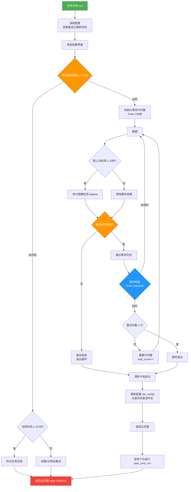

# 寮宴会（GuildBanquet）任务详解

## 1. 文件概述

寮宴会任务由三个文件组成，各司其职：

| 文件 | 行数 | 职责 |
|------|------|------|
| `config.py` | 44行 | 定义配置模型，使用 Pydantic 管理宴会日期和时间参数 |
| `assets.py` | 17行 | 定义图像识别资源，由工具自动生成，包含用于检测宴会状态的图片规则 |
| `script_task.py` | 202行 | 核心任务逻辑，负责导航到寮界面、检测宴会状态、等待结束、安排下次运行 |

**任务目标**：自动检测并参与阴阳师「寮宴会」活动，等待宴会结束后自动安排下一次运行时间。

---

## 2. 配置参数说明（config.py）

### 2.1 Weekday 枚举（第12-19行）

```python
class Weekday(str, Enum):
    Monday: str = "星期一"
    Tuesday: str = "星期二"
    Wednesday: str = "星期三"
    Thursday: str = "星期四"
    Friday: str = "星期五"
    Saturday: str = "星期六"
    Sunday: str = "星期日"
```

- 继承 `str` 和 `Enum`，实现字符串枚举
- 使用中文值便于在配置界面直接显示
- Pydantic 序列化时会输出中文字符串

### 2.2 GuildBanquetTime 模型（第22-38行）

```python
class GuildBanquetTime(BaseModel):
    day_1: Weekday = Field(default=Weekday.Wednesday, ...)
    run_time_1: Time = Field(default=Time(hour=19, minute=0, second=0))
    day_2: Weekday = Field(default=Weekday.Saturday, ...)
    run_time_2: Time = Field(default=Time(hour=19, minute=0, second=0), ...)
    hide_fileds = dynamic_hide('run_time_1', 'run_time_2')
```

| 参数 | 类型 | 默认值 | 说明 |
|------|------|--------|------|
| `day_1` | Weekday | 星期三 | 每周第1次宴会的星期几，必须早于 `day_2` |
| `run_time_1` | Time | 19:00:00 | 第1次宴会的开始时间 |
| `day_2` | Weekday | 星期六 | 每周第2次宴会的星期几 |
| `run_time_2` | Time | 19:00:00 | 第2次宴会的开始时间 |

- `hide_fileds`：使用 `dynamic_hide` 动态控制前端字段的可见性（可能根据某些条件隐藏时间输入框）

### 2.3 GuildBanquet 主配置（第41-43行）

```python
class GuildBanquet(ConfigBase):
    scheduler: Scheduler = Field(default_factory=Scheduler)
    guild_banquet_time: GuildBanquetTime = Field(default_factory=GuildBanquetTime)
```

- 继承 `ConfigBase` 获得基础配置能力
- `scheduler`：调度器配置（来自公共组件），控制任务的启用/禁用及基础调度
- `guild_banquet_time`：嵌套的宴会时间配置

---

## 3. 资源定义说明（assets.py）

```python
class GuildBanquetAssets:
    I_FLAG = RuleImage(
        roi_front=(1035, 12, 33, 60),
        roi_back=(1035, 12, 33, 60),
        threshold=0.8,
        method="Template matching",
        file="./tasks/GuildBanquet/res/res_flag.png"
    )
```

| 参数 | 值 | 说明 |
|------|----|------|
| `roi_front` | (1035, 12, 33, 60) | 前台识别区域：x=1035, y=12, 宽=33, 高=60（屏幕右上角） |
| `roi_back` | (1035, 12, 33, 60) | 后台识别区域：与前台相同 |
| `threshold` | 0.8 | 匹配阈值，相似度 ≥ 80% 视为匹配成功 |
| `method` | "Template matching" | 使用模板匹配算法 |
| `file` | res_flag.png | 模板图片资源路径 |

**用途**：`I_FLAG` 是寮宴会活动的标识图标，出现在屏幕右上角时表示宴会正在进行中。

---

## 4. 核心代码逐行解释（script_task.py）

### 4.1 导入部分（第1-14行）

```python
from datetime import datetime, timedelta   # 日期时间处理
from enum import Enum                       # 枚举类型
import time                                 # 时间戳获取

from module.exception import TaskEnd        # 任务结束异常（用于终止任务流程）
from module.logger import logger            # 日志记录器
from module.base.timer import Timer         # 计时器工具

from tasks.GameUi.game_ui import GameUi     # 游戏UI操作基类（提供页面导航能力）
from tasks.GameUi.page import page_guild, page_main  # 预定义的页面节点
from tasks.GuildBanquet.assets import GuildBanquetAssets  # 图像资源
```

- `TaskEnd` 是框架级别的异常，`raise TaskEnd` 表示任务正常/异常结束，调度器会捕获并处理
- `GameUi` 提供 `ui_get_current_page()`、`ui_goto()` 等页面导航方法

### 4.2 WEEKDAYDICT 字典（第16-24行）

```python
WEEKDAYDICT = {
    0: '星期一', 1: '星期二', 2: '星期三',
    3: '星期四', 4: '星期五', 5: '星期六', 6: '星期日'
}
```

- `datetime.weekday()` 返回 0-6（0=周一），此字典用于将数字转为中文星期
- 与 `Weekday` 枚举配合使用，实现「数字 → 中文 → 枚举」的转换链

### 4.3 ScriptTask 类定义（第35行）

```python
class ScriptTask(GameUi, GuildBanquetAssets):
```

- **多重继承**：
  - `GameUi`：提供 UI 导航能力（`ui_goto`、`ui_get_current_page`、`screenshot` 等）
  - `GuildBanquetAssets`：提供图像资源（`I_FLAG`）
- 这是框架的标准模式——任务类通过继承组合所需能力

### 4.4 run() 主方法（第37-116行）

#### 4.4.1 初始化配置（第38-45行）

```python
def run(self):
    self.run_time = self.config.guild_banquet.guild_banquet_time
    # 第一天宴会日期及时间
    self.banquet_day_1 = self.get_key_from_value(WEEKDAYDICT, self.run_time.day_1.value)
    self.banquet_day_1_start_time = self.run_time.run_time_1
    # 第二天宴会日期及时间
    self.banquet_day_2 = self.get_key_from_value(WEEKDAYDICT, self.run_time.day_2.value)
    self.banquet_day_2_start_time = self.run_time.run_time_2
```

- 从配置中读取宴会时间设置
- `get_key_from_value` 将中文星期（如 "星期三"）转回数字（如 2），便于后续日期比较
- 例如：`day_1.value = "星期三"` → `banquet_day_1 = 2`

#### 4.4.2 页面导航（第48-49行）

```python
self.ui_get_current_page()   # 检测当前所在页面
self.ui_goto(page_guild)      # 导航到寮界面
```

- 框架的页面导航机制：先识别当前页面，再通过预定义路径跳转到目标页面

#### 4.4.3 检测宴会标识（第51-67行）

```python
if self.appear(self.I_FLAG):          # 检测屏幕右上角是否有宴会图标
    wait_count = 0
    wait_timer = Timer(230)            # 230秒 ≈ 3分50秒的超时计时器
    wait_timer.start()
    logger.info("Start guild banquet!")
    self.device.stuck_record_add('BATTLE_STATUS_S')  # 添加卡死检测标记
else:
    if self.check_runtime():           # 检查是否超过22点
        time_now = datetime.now()
        time_later = time_now + timedelta(minutes=5)
        self.set_next_run(task='GuildBanquet', finish=True, target=time_later)
    self.ui_get_current_page()
    self.ui_goto(page_main)            # 返回主页面
    raise TaskEnd                      # 结束任务
```

**逻辑说明**：
- 如果找到宴会图标 → 进入等待循环
- 如果未找到 → 检查当前时间：
  - 未超过22点：可能宴会还没开始，设置5分钟后重试
  - 超过22点：配置可能有误，标记失败

#### 4.4.4 等待循环核心（第69-116行）

```python
last_check_time = 0      # 上次实际图像检测的时间戳
last_log_time = 0         # 上次输出日志的时间戳
last_flag_status = False  # 缓存的检测结果

while True:
    self.screenshot()                    # 截取当前屏幕
    current_time = time.time()

    # 条件1: 每10秒执行一次真实图像检测（节省性能）
    if current_time - last_check_time >= 10:
        actual_status = self.appear(self.I_FLAG)    # 真实检测
        last_flag_status = actual_status
        last_check_time = current_time
    else:
        pass  # 未达间隔，沿用缓存结果

    # 条件2: 状态判断
    if last_flag_status:
        if current_time - last_log_time >= 10:
            logger.info("Banquet ongoing, waiting...")
            last_log_time = current_time
    else:
        logger.info("Guild banquet end")
        break                        # 宴会结束，退出循环

    # 条件3: 超时保护（230秒 × 4次 ≈ 15分钟）
    if wait_timer.reached():
        wait_timer.reset()
        if wait_count >= 3:
            logger.info('Guild banquet timeout')
            break                    # 超时退出
        wait_count += 1
        self.device.stuck_record_clear()
        self.device.stuck_record_add('BATTLE_STATUS_S')
```

**性能优化策略**：
- 不是每帧都做图像检测，而是每10秒检测一次
- 中间帧沿用缓存结果，减少 CPU 消耗
- 日志也限制为每10秒输出一次，避免日志刷屏

**超时保护**：
- 宴会最长约15分钟，使用 `Timer(230)` + `wait_count` 双重控制
- `stuck_record_add/clear` 用于防止设备卡死检测误判

#### 4.4.5 结束处理（第111-116行）

```python
self.device.stuck_record_clear()    # 清除卡死标记
self.set_config()                    # 更新配置（记录实际宴会时长）
self.ui_get_current_page()
self.ui_goto(page_main)              # 返回主页面
self.plan_next_run()                 # 安排下次运行
raise TaskEnd                        # 任务结束
```

### 4.5 check_runtime() 方法（第118-128行）

```python
def check_runtime(self) -> bool:
    if datetime.now().hour >= 22:
        self.set_next_run(task="GuildBanquet", success=False)
        logger.error("Guild banquet time config error, set next run fail")
        return False
    return True
```

- 如果当前时间超过22:00，认为配置时间有误（一般寮不会这么晚开宴会）
- 标记任务失败并返回 `False`

### 4.6 plan_next_run() 方法（第130-142行）

```python
def plan_next_run(self):
    today = datetime.now().weekday()          # 0=周一, 6=周日

    if today < self.banquet_day_1:
        # 今天在第1天之前 → 下次运行是第1天
        self.custom_next_run(task='GuildBanquet',
            custom_time=self.banquet_day_1_start_time,
            time_delta=self.banquet_day_1 - today)
    elif self.banquet_day_1 <= today < self.banquet_day_2:
        # 今天在第1天和第2天之间 → 下次运行是第2天
        self.custom_next_run(task='GuildBanquet',
            custom_time=self.banquet_day_2_start_time,
            time_delta=self.banquet_day_2 - today)
    elif self.banquet_day_2 <= today:
        # 今天在第2天之后 → 下次运行是下周的第1天
        self.custom_next_run(task='GuildBanquet',
            custom_time=self.banquet_day_1_start_time,
            time_delta=7 - today + self.banquet_day_1)
```

**调度逻辑示例**（假设 day_1=周三, day_2=周六）：

| 今天 | 下次运行 | time_delta |
|------|---------|------------|
| 周一 | 周三 | 2天 |
| 周三 | 周六 | 3天 |
| 周六 | 下周三 | 4天 |
| 周日 | 下周三 | 3天 |

### 4.7 set_config() 方法（第152-192行）

```python
def set_config(self):
    try:
        # 将宴会实际结束时间提前约15分钟作为「开始时间」
        next_time = datetime.now() - timedelta(minutes=14, seconds=55)
        next_time = next_time.replace(second=0, microsecond=0)
        next_time = datetime.time(next_time)

        today = datetime.now().weekday()

        # 根据今天是哪天，更新对应的配置项
        if today == self.banquet_day_1:
            self.run_time.run_time_1 = next_time
        elif today == self.banquet_day_2:
            self.run_time.run_time_2 = next_time
        elif today < self.banquet_day_1:
            self.run_time.day_1 = self.get_weekday_enum(WEEKDAYDICT.get(today))
            self.run_time.run_time_1 = next_time
        elif today > self.banquet_day_2:
            self.run_time.day_2 = self.get_weekday_enum(WEEKDAYDICT.get(today))
            self.run_time.run_time_2 = next_time
        else:
            # 两个配置日期之间：工作日设为day_1，周末设为day_2
            if today <= 4:
                self.run_time.day_1 = self.get_weekday_enum(WEEKDAYDICT.get(today))
                self.run_time.run_time_1 = next_time
            else:
                self.run_time.day_2 = self.get_weekday_enum(WEEKDAYDICT.get(today))
                self.run_time.run_time_2 = next_time

        self.config.save()    # 持久化配置到文件
    except Exception as e:
        logger.error(f"Error setting banquet config: {e}")
        raise TaskEnd
```

**设计意图**：宴会结束后，自动修正配置中的时间。因为识图误差可能导致宴会被提前几秒判定结束，所以用「结束时间 - 15分钟」反推开始时间。

### 4.8 辅助方法（第144-151行）

```python
def get_key_from_value(self, dict, value):
    return [k for k, v in dict.items() if v == value][0]

def get_weekday_enum(self, value: str) -> Weekday:
    for day in Weekday:
        if day.value == value:
            return day
```

- `get_key_from_value`：字典反查，从值找键（如 "星期三" → 2）
- `get_weekday_enum`：字符串转 Weekday 枚举实例

### 4.9 入口代码（第195-201行）

```python
if __name__ == '__main__':
    from module.config.config import Config
    from module.device.device import Device
    c = Config('oas1')        # 加载配置（oas1 是配置名/实例名）
    d = Device(c)              # 初始化设备连接
    t = ScriptTask(c, d)       # 创建任务实例
    t.run()                    # 执行任务
```

- 仅供本地调试使用，框架调度时由调度器自动实例化

---

## 5. 任务执行流程图



---

## 6. 设计模式总结

### 6.1 继承组合模式

```
ScriptTask
├── GameUi          → UI 导航能力（ui_goto, screenshot, appear...）
└── GuildBanquetAssets → 图像资源（I_FLAG）
```

通过多重继承将「能力」和「资源」注入任务类，避免重复代码。

### 6.2 状态缓存 + 间隔检测

```
每10秒: 真实图像检测 → 更新缓存
其他帧: 使用缓存结果 → 跳过检测
```

- 平衡了检测准确性和性能开销
- 避免每帧都执行昂贵的模板匹配

### 6.3 自适应时间学习

宴会结束后，`set_config()` 会根据实际结束时间反推开始时间并更新配置。系统「学习」真实的宴会时间，下次运行更精准。

### 6.4 异常驱动的任务流控

```python
raise TaskEnd  # 正常结束 / 异常结束都使用同一个异常类
```

- 框架通过捕获 `TaskEnd` 统一处理任务生命周期
- 简化了多层嵌套中的退出逻辑

### 6.5 双重超时保护

```python
Timer(230)        # 单次超时：约3分50秒
wait_count >= 3   # 重试上限：3次
# 总超时 ≈ 15分钟（符合宴会实际时长）
```

防止因图像识别异常导致的无限等待。

### 6.6 配置驱动调度

```
plan_next_run() → 根据「今天 vs 两个宴会日」的相对位置 → 计算下次运行时间
set_config()    → 根据实际运行结果 → 自动修正配置
```

配置既是输入也是输出，形成闭环。
