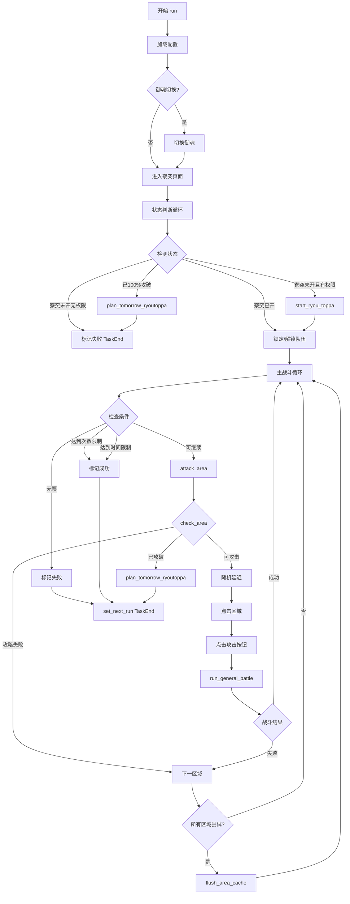

# 寮突破 (RyouToppa) 任务详解

## 1. 文件概述

寮突破是阴阳师游戏中阴阳寮（公会）的集体PVP玩法。本自动化脚本实现了以下核心功能：

- **自动开启寮突破**：寮管理可自动开启当日寮突
- **智能区域选择**：按顺序攻打8个区域，自动跳过失败/已攻破区域
- **票数检测**：检测进攻次数，无票时自动等待
- **团队锁定**：支持锁定/解锁阵容
- **定时调度**：支持设置下次运行时间，100%攻破后自动安排明日任务

### 文件结构

```
tasks/RyouToppa/
├── script_task.py    # 核心业务逻辑（333行）
├── config.py         # 配置参数定义（41行）
└── assets.py         # 图像/点击/OCR资源定义（143行）
```

---

## 2. 配置参数说明 (config.py)

### 2.1 RaidConfig - 突破配置

| 字段 | 类型 | 默认值 | 说明 |
|------|------|--------|------|
| `limit_time` | Time | 30分钟 | 单次任务最大执行时间 |
| `limit_count` | int | 50 | 单次任务最大攻击次数 |
| `next_ryoutoppa_time` | Time | 07:00:00 | 攻破完成后指定下次运行时间 |
| `skip_difficult` | bool | True | 是否跳过难度较高的结界，失败后不再攻打 |
| `ryou_access` | bool | False | 是否为寮管理（有权限开启寮突） |
| `random_delay` | bool | False | 是否启用2-10秒随机延迟防检测 |

### 2.2 RyouToppa - 主配置类

| 字段 | 类型 | 说明 |
|------|------|------|
| `scheduler` | Scheduler | 调度器配置 |
| `raid_config` | RaidConfig | 突破专用配置 |
| `general_battle_config` | GeneralBattleConfig | 通用战斗配置 |
| `switch_soul_config` | SwitchSoulConfig | 御魂切换配置 |

---

## 3. 资源定义说明 (assets.py)

### 3.1 Click Rule Assets - 点击区域

用于点击8个突破区域的坐标定义：

| 资源名 | 区域 | ROI坐标 (x,y,w,h) |
|--------|------|-------------------|
| `C_AREA_1` | 区域1 | (533,162,177,74) |
| `C_AREA_2` | 区域2 | (863,164,181,71) |
| `C_AREA_3` | 区域3 | (532,292,181,87) |
| `C_AREA_4` | 区域4 | (863,301,171,62) |
| `C_AREA_5` | 区域5 | (540,432,169,68) |
| `C_AREA_6` | 区域6 | (876,432,165,74) |
| `C_AREA_7` | 区域7 | (538,557,149,71) |
| `C_AREA_8` | 区域8 | (876,562,150,67) |
| `C_SAFE_AREA` | 安全区 | (182,213,160,229) |

### 3.2 Image Rule Assets - 失败标记

检测区域攻略失败的图像（每个区域有两种失败标记）：

- **I_AREA_X_IS_FAILURE**：历史失败标记
- **I_AREA_X_IS_FAILURE_NEW**：最近一次失败标记

### 3.3 Image Rule Assets - 已攻破标记

检测区域已攻破的图像：

- **I_AREA_X_FINISHED**：已攻破标记
- **I_AREA_X_FINISHED_NEW**：新攻破标记

### 3.4 状态检测资源

| 资源名 | 用途 | 阈值 |
|--------|------|------|
| `I_TOPPA_RECORD` | 突破记录标识 | 0.8 |
| `I_TOPPA_LOCK_TEAM` | 锁定队伍状态 | 0.8 |
| `I_TOPPA_UNLOCK_TEAM` | 解锁队伍状态 | 0.8 |

### 3.5 寮突破流程资源

| 资源名 | 用途 | 阈值 |
|--------|------|------|
| `I_RYOU_TOPPA` | 寮突入口 | 0.6 |
| `I_SELECT_RYOU_BUTTON` | 选择阴阳寮按钮 | 0.8 |
| `I_NO_SELECT_RYOU` | 未选择阴阳寮状态 | 0.8 |
| `I_START_TOPPA_BUTTON` | 开始寮突按钮 | 0.8 |
| `I_RYOU_REWARD` | 寮击破奖励 | 0.65 |
| `I_GUILD_ORDERS_REWARDS` | 勋章奖励标题 | 0.8 |
| `I_SUCCESS_PENETRATION` | 攻破阴阳寮标识 | 0.8 |
| `I_REAL_RAID_REFRESH` | 个人突破刷新按钮 | 0.8 |
| `I_RYOU_REWARD_90` | 击破后的寮奖励 | 0.8 |

### 3.6 OCR资源

| 资源名 | 用途 | 模式 |
|--------|------|------|
| `O_NUMBER` | 寮突破进攻机会数识别 | DigitCounter |

---

## 4. 核心代码逐行解释 (script_task.py)

### 4.1 导入与初始化 (第1-22行)

```python
import time
from datetime import datetime, timedelta, time as dt_time
import random
```
- `time`：用于延迟等待
- `datetime/timedelta`：时间计算
- `random`：生成随机数

```python
from tasks.Component.SwitchSoul.switch_soul import SwitchSoul
from tasks.RyouToppa.assets import RyouToppaAssets
from tasks.Component.GeneralBattle.general_battle import GeneralBattle
from tasks.Component.config_base import ConfigBase, Time
from tasks.GameUi.game_ui import GameUi
from tasks.GameUi.page import page_realm_raid, page_main, page_kekkai_toppa, page_shikigami_records
from tasks.RealmRaid.assets import RealmRaidAssets
```
- `SwitchSoul`：御魂切换组件
- `GeneralBattle`：通用战斗组件
- `GameUi`：游戏UI导航组件
- `page_*`：游戏页面定义

### 4.2 区域映射表 (第25-66行)

```python
area_map = (
    {
        "fail_sign": (RyouToppaAssets.I_AREA_1_IS_FAILURE_NEW, RyouToppaAssets.I_AREA_1_IS_FAILURE),
        "rule_click": RyouToppaAssets.C_AREA_1,
        "finished_sign": (RyouToppaAssets.I_AREA_1_FINISHED, RyouToppaAssets.I_AREA_1_FINISHED_NEW)
    },
    # ... 共8个区域
)
```

**数据结构说明**：
- `fail_sign`：包含新旧两种失败标记的元组
- `rule_click`：该区域的点击坐标
- `finished_sign`：包含新旧两种已攻破标记的元组

### 4.3 随机延迟函数 (第69-74行)

```python
def random_delay(min_value: float = 1.0, max_value: float = 2.0, decimal: int = 1):
    random_float_in_range = random.uniform(min_value, max_value)
    return (round(random_float_in_range, decimal))
```

**功能**：生成指定范围内的随机小数，用于防检测

### 4.4 ScriptTask类定义 (第76行)

```python
class ScriptTask(GeneralBattle, GameUi, SwitchSoul, RyouToppaAssets):
```

**多重继承**：
- `GeneralBattle`：通用战斗能力
- `GameUi`：UI导航能力
- `SwitchSoul`：御魂切换能力
- `RyouToppaAssets`：资源访问能力

### 4.5 run() 主执行方法 (第79-193行)

#### 4.5.1 初始化配置 (第84-88行)

```python
ryou_config = self.config.ryou_toppa
time_limit: Time = ryou_config.raid_config.limit_time
time_delta = timedelta(hours=time_limit.hour, minutes=time_limit.minute, seconds=time_limit.second)
self.medal_grid = ImageGrid([RealmRaidAssets.I_MEDAL_5, ...])
```
- 获取配置
- 计算时间限制
- 初始化勋章网格（用于识别勋章等级）

#### 4.5.2 御魂切换 (第90-98行)

```python
if ryou_config.switch_soul_config.enable:
    self.ui_get_current_page()
    self.ui_goto(page_shikigami_records)
    self.run_switch_soul(ryou_config.switch_soul_config.switch_group_team)

if ryou_config.switch_soul_config.enable_switch_by_name:
    self.ui_get_current_page()
    self.ui_goto(page_shikigami_records)
    self.run_switch_soul_by_name(...)
```

**两种切换方式**：
1. 按组号切换
2. 按名称切换

#### 4.5.3 进入寮突页面 (第100-101行)

```python
self.ui_get_current_page()
self.ui_goto(page_kekkai_toppa)
```

#### 4.5.4 状态判断循环 (第106-130行)

```python
while 1:
    self.screenshot()
    if self.appear_then_click(RealmRaidAssets.I_REALM_RAID, interval=1):
        continue
    if self.appear(self.I_REAL_RAID_REFRESH, threshold=0.8):
        if self.appear_then_click(self.I_RYOU_TOPPA, interval=1):
            continue
    elif self.appear(self.I_SUCCESS_PENETRATION, threshold=0.8):
        ryou_toppa_start_flag = True
        ryou_toppa_success_penetration = True
        break
    elif self.appear(self.I_SELECT_RYOU_BUTTON, threshold=0.8):
        ryou_toppa_start_flag = False
        ryou_toppa_admin_flag = True
        break
    elif self.appear(self.I_NO_SELECT_RYOU, threshold=0.8):
        ryou_toppa_start_flag = False
        break
    elif self.appear(self.I_RYOU_REWARD, threshold=0.8) or self.appear(self.I_RYOU_REWARD_90, threshold=0.8):
        ryou_toppa_start_flag = True
        break
```

**状态判断逻辑**：
| 检测到的图像 | 状态设置 |
|-------------|---------|
| `I_SUCCESS_PENETRATION` | 已100%攻破 |
| `I_SELECT_RYOU_BUTTON` | 寮突未开，有管理权限 |
| `I_NO_SELECT_RYOU` | 寮突未开，无管理权限 |
| `I_RYOU_REWARD` / `I_RYOU_REWARD_90` | 寮突已开启 |

#### 4.5.5 处理寮突未开情况 (第135-143行)

```python
if not ryou_toppa_start_flag:
    if ryou_config.raid_config.ryou_access and ryou_toppa_admin_flag:
        self.start_ryou_toppa()
    else:
        self.set_next_run(task='RyouToppa', finish=True, server=True, success=False)
        raise TaskEnd
```

#### 4.5.6 处理100%攻破情况 (第146-149行)

```python
if ryou_toppa_success_penetration:
    self.plan_tomorrow_ryoutoppa()
    raise TaskEnd
```

#### 4.5.7 锁定/解锁队伍 (第150-155行)

```python
if self.config.ryou_toppa.general_battle_config.lock_team_enable:
    self.ui_click(self.I_TOPPA_UNLOCK_TEAM, self.I_TOPPA_LOCK_TEAM)
else:
    self.ui_click(self.I_TOPPA_LOCK_TEAM, self.I_TOPPA_UNLOCK_TEAM)
```

#### 4.5.8 主战斗循环 (第159-183行)

```python
area_index = 0
success = True
while 1:
    self.device.stuck_record_add('PREPARE_BEFORE_BATTLE')
    if not self.has_ticket():
        success = False
        break
    if self.current_count >= ryou_config.raid_config.limit_count:
        break
    if datetime.now() >= self.start_time + time_delta:
        break
    res = self.attack_area(area_index)
    if not res:
        area_index += 1
        if area_index >= len(area_map):
            area_index = 0
            self.flush_area_cache()
        continue
```

**循环控制**：
- 无票 → 结束
- 达到次数限制 → 结束
- 达到时间限制 → 结束
- 攻击失败 → 尝试下一区域
- 所有区域不可用 → 刷新区域缓存

### 4.6 plan_tomorrow_ryoutoppa() 方法 (第195-203行)

```python
def plan_tomorrow_ryoutoppa(self):
    now = datetime.now()
    if now.time() < dt_time(5, 0):
        self.custom_next_run(task='RyouToppa', custom_time=self.config.ryou_toppa.raid_config.next_ryoutoppa_time, time_delta=0)
    else:
        self.custom_next_run(task='RyouToppa', custom_time=self.config.ryou_toppa.raid_config.next_ryoutoppa_time, time_delta=1)
```

**逻辑**：
- 00:00-05:00 → 设定为当天自定义时间
- 05:00-23:59 → 设定为明天自定义时间

### 4.7 start_ryou_toppa() 方法 (第205-232行)

```python
def start_ryou_toppa(self):
    # 点击寮突按钮
    while 1:
        self.screenshot()
        if self.appear_then_click(self.I_SELECT_RYOU_BUTTON, interval=1):
            break
    
    # 选择第一个寮
    while 1:
        self.screenshot()
        if self.appear_then_click(self.I_GUILD_ORDERS_REWARDS, action=self.C_SELECT_FIRST_RYOU, interval=1):
            break
    
    # 点击开始突入
    while 1:
        self.screenshot()
        if self.appear_then_click(self.I_START_TOPPA_BUTTON, interval=1):
            continue
        if self.appear(self.I_RYOU_REWARD, threshold=0.8):
            break
```

**开启流程**：
1. 点击"选择阴阳寮"按钮
2. 选择第一个寮
3. 点击"开始突入"按钮
4. 等待寮奖励出现确认开启成功

### 4.8 has_ticket() 方法 (第234-248行)

```python
def has_ticket(self) -> bool:
    if datetime.now().hour >= 21 or datetime.now().hour <= 5:
        return True
    self.wait_until_appear(self.I_TOPPA_RECORD)
    self.screenshot()
    cu, res, total = self.O_NUMBER.ocr(self.device.image)
    if cu == 0 and cu + res == total:
        return False
    return True
```

**逻辑**：
- 21:00-05:00 → 无限票（返回True）
- 其他时间 → OCR识别票数，cu=0且无剩余时返回False

### 4.9 check_area() 方法 (第250-268行)

```python
def check_area(self, index: int) -> bool:
    f1, f2 = area_map[index].get("fail_sign")
    f3, f4 = area_map[index].get("finished_sign")
    self.screenshot()
    if self.appear(f3, threshold=0.8) or self.appear(f4, threshold=0.8):
        self.plan_tomorrow_ryoutoppa()
        raise TaskEnd
    if self.appear(f1, threshold=0.8) or self.appear(f2, threshold=0.8):
        return False
    return True
```

**返回值**：
- `True`：区域可攻击
- `False`：区域攻略失败
- `TaskEnd`：所有区域已攻破

### 4.10 flush_area_cache() 方法 (第270-284行)

```python
def flush_area_cache(self):
    time.sleep(2)
    duration = 0.352
    count = random.randint(1, 3)
    for i in range(count):
        safe_pos_x = random.randint(540, 1000)
        safe_pos_y = random.randint(320, 540)
        p1 = (safe_pos_x, safe_pos_y)
        p2 = (safe_pos_x, safe_pos_y - 101)
        self.device.swipe_adb(p1, p2, duration=duration)
        time.sleep(2)
```

**功能**：通过随机滑动刷新区域列表，参数经过精心调试

### 4.11 attack_area() 方法 (第286-323行)

```python
def attack_area(self, index: int):
    if not self.check_area(index):
        return False
    if self.config.ryou_toppa.raid_config.random_delay:
        delay = random_delay()
        time.sleep(delay)
    
    rcl = area_map[index].get("rule_click")
    click_failure_count = 0
    while True:
        self.screenshot()
        if click_failure_count >= 5:
            return False
        if not self.appear(self.I_TOPPA_RECORD, threshold=0.85):
            time.sleep(1)
            self.screenshot()
            if self.appear(self.I_TOPPA_RECORD, threshold=0.85):
                continue
            return self.run_general_battle(config=self.config.ryou_toppa.general_battle_config)
        if self.appear_then_click(RealmRaidAssets.I_FIRE, interval=2, threshold=0.8):
            click_failure_count += 1
            continue
        if self.click(rcl, interval=5):
            click_failure_count += 1
            continue
```

**攻击流程**：
1. 检查区域可用性
2. 可选随机延迟
3. 点击区域 → 点击攻击按钮
4. 进入战斗 → 调用通用战斗模块
5. 点击失败超过5次 → 返回失败

---

## 5. 任务执行流程图



---

## 6. 设计模式总结

### 6.1 组件化模式

通过多重继承组合功能：
```python
class ScriptTask(GeneralBattle, GameUi, SwitchSoul, RyouToppaAssets):
```
- 职责分离：战斗、UI、御魂、资源各自独立
- 代码复用：通用逻辑在组件中实现

### 6.2 状态机模式

使用循环+条件判断实现状态转换：
```python
while 1:
    if 条件A: 状态A
    elif 条件B: 状态B
    elif 条件C: 状态C
    else: 默认状态
```

### 6.3 资源映射模式

区域信息通过字典映射：
```python
area_map = (
    {"fail_sign": ..., "rule_click": ..., "finished_sign": ...},
    # ...
)
```

### 6.4 防检测策略

1. **随机延迟**：攻击间隔随机化
2. **随机滑动**：刷新区域时随机位置
3. **点击计数**：避免无限循环点击

### 6.5 异常处理模式

使用 `TaskEnd` 异常控制任务结束：
```python
raise TaskEnd  # 正常结束
raise TaskEnd  # 异常结束
```

### 6.6 OCR识别模式

使用 `RuleOcr` 进行数字识别：
```python
cu, res, total = self.O_NUMBER.ocr(self.device.image)
```

---

## 附录：关键配置示例

```json
{
  "ryou_toppa": {
    "scheduler": {
      "enable": true,
      "next_run": "2024-01-01 07:00:00"
    },
    "raid_config": {
      "limit_time": "00:30:00",
      "limit_count": 50,
      "next_ryoutoppa_time": "07:00:00",
      "skip_difficult": true,
      "ryou_access": false,
      "random_delay": true
    },
    "general_battle_config": {
      "lock_team_enable": true
    },
    "switch_soul_config": {
      "enable": false,
      "switch_group_team": "1-1"
    }
  }
}
```
